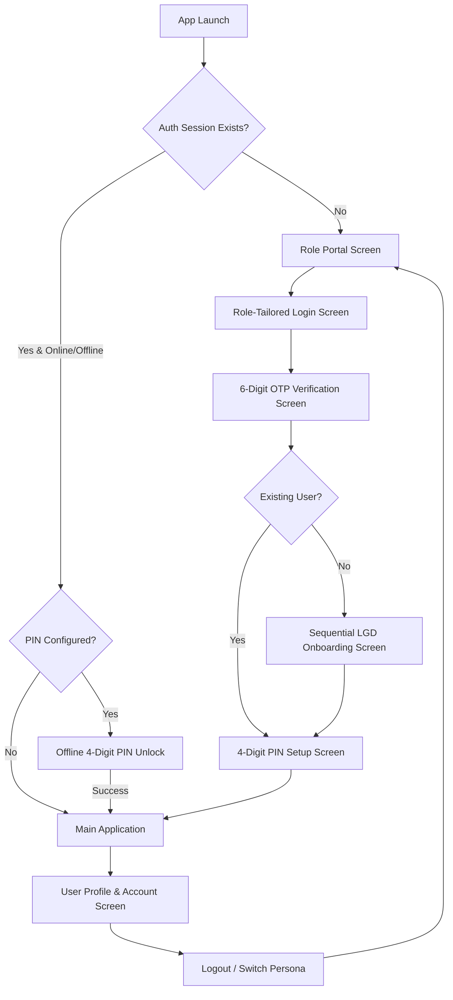

# Phase 11 Context: Role-Based Authentication Screens & User Onboarding

**Phase:** 11  
**Name:** Role-Based Authentication Screens & User Onboarding  
**Created:** 2026-09-05  
**Requirements Covered:** AUTH-01, AUTH-02, AUTH-03, AUTH-04, AUTH-05  

---

## 1. Executive Summary

This phase implements production-grade, offline-resilient authentication and onboarding screens for Pashu-Suraksha (पशु सुरक्षा). It replaces the initial demo-only instant role-switcher with a complete sequential authentication pipeline tailored to the 3 rural livestock stakeholders:
1. **Farmer / Livestock Owner (पशुपालक)**
2. **Field Veterinarian & Para-vet / Pashu Sakhi (पशुवैद्य / पशु सखी)**
3. **District Animal Husbandry Officer / DVO (जिल्हा अधिकारी)**

The flow adheres to India's DPDP Act 2023 requirements, supports vernacular language localization (English, Marathi, Hindi), and guarantees offline survivability through a 4-digit Security PIN stored in encrypted SQLite.

---

## 2. Sequential Auth Flow Architecture



---

## 3. Screen Specifications

### Screen 1: Role Portal Selection (`RolePortalView.tsx`)
- **Visuals:** High-contrast cards for Farmer, Doctor/Pashu Sakhi, and District Admin.
- **Micro-interactions:** Tactile haptics on card selection, clear role badge, and role description in active language (Marathi/Hindi/English).

### Screen 2: Role-Tailored Mobile & Identifier Login (`LoginView.tsx`)
- **Farmer Form:** 10-digit Indian Mobile number (`+91`) input with vernacular voice assistance prompt.
- **Doctor Form:** 10-digit Mobile number + Veterinary Council Registration / License No (e.g. `MH-VCI-2024-XXXX`).
- **Admin Form:** 10-digit Mobile number / Official Gov Email + District Officer Authorization Code.
- **Validation:** Instant regex validation, tactile error vibration, and "Send OTP" CTA.

### Screen 3: 6-Digit OTP Verification (`OtpVerificationView.tsx`)
- **Inputs:** 6 individual digit boxes with auto-advance, backspace handling, and paste support.
- **Timer:** 30-second countdown before "Resend OTP" is enabled.
- **Auto-Fill / Mocking for SIH Jury:** Displays simulated SMS banner or 1-tap demo auto-fill (`123456`) for rapid evaluation during hackathon presentations.

### Screen 4: Sequential User Onboarding (`OnboardingView.tsx`)
- **Farmer / Pashu Sakhi Fields:** Full Name, Gender, District (pre-loaded with Maharashtra districts: Ahmednagar, Pune, Solapur, etc.), Taluka/Block (Rahuri, Sangamner, etc.), Village name.
- **Doctor Fields:** Full Name, Designation (LDO / Pashu Sakhi / Veterinary Officer), Assigned Clinic/Dispensary, Jurisdictional Blocks.
- **Admin Fields:** Full Name, Designation (DVO / Joint Director), District Headquarters.
- **Persistence:** Saved immediately into SQLite `user_credentials` table and synchronized via delta sync.

### Screen 5: 4-Digit Offline Security PIN Setup & Unlock (`OfflinePinView.tsx`)
- **Purpose:** Rural livestock surveillance frequently occurs in cellular dead zones where SMS OTP verification cannot occur.
- **Setup Mode:** Farmer / Vet enters 4-digit PIN + confirmation. Encrypted and stored in SQLite.
- **Unlock Mode:** Used on app open when session is locked; fallback to Biometrics or SMS if network returns.

### Screen 6: User Profile & Account Settings (`UserProfileView.tsx`)
- **Display:** Active role badge, user name, DPDP-masked mobile number (`+91 9822X-XX412`), jurisdiction details.
- **Features:** 
  - Language toggle (English / मराठी / हिंदी).
  - Offline sync status summary (number of queued reports).
  - SIH Quick Persona Switcher shortcut (retaining hackathon convenience).
  - Secure Logout action (clears active session token and returns to Role Portal).

---

## 4. SQLite Schema Additions

```sql
CREATE TABLE IF NOT EXISTS user_credentials (
    id TEXT PRIMARY KEY,
    role TEXT NOT NULL, -- 'consumer' | 'doctor' | 'admin'
    full_name TEXT NOT NULL,
    mobile_hash TEXT NOT NULL,
    mobile_masked TEXT NOT NULL,
    license_or_id TEXT,
    district TEXT NOT NULL,
    block TEXT NOT NULL,
    village TEXT,
    offline_pin_hash TEXT,
    is_verified INTEGER DEFAULT 1,
    created_at TEXT NOT NULL,
    updated_at TEXT NOT NULL
);

CREATE TABLE IF NOT EXISTS auth_session (
    id TEXT PRIMARY KEY,
    user_id TEXT,
    active_role TEXT NOT NULL,
    display_name TEXT NOT NULL,
    district TEXT NOT NULL,
    block TEXT NOT NULL,
    session_token TEXT,
    is_locked INTEGER DEFAULT 0,
    updated_at TEXT NOT NULL
);
```

---

## 5. Verification Plan
- Unit & integration tests in `mobile/src/tests/authScreens.test.ts`.
- Validations:
  1. Phone number formatting and validation.
  2. OTP digit navigation and resend timer behavior.
  3. Offline PIN setup, hashing, verification, and incorrect PIN lockout.
  4. Role-based routing and bottom bar permission alignment.
  5. Session persistence and logout behavior across app restarts.
