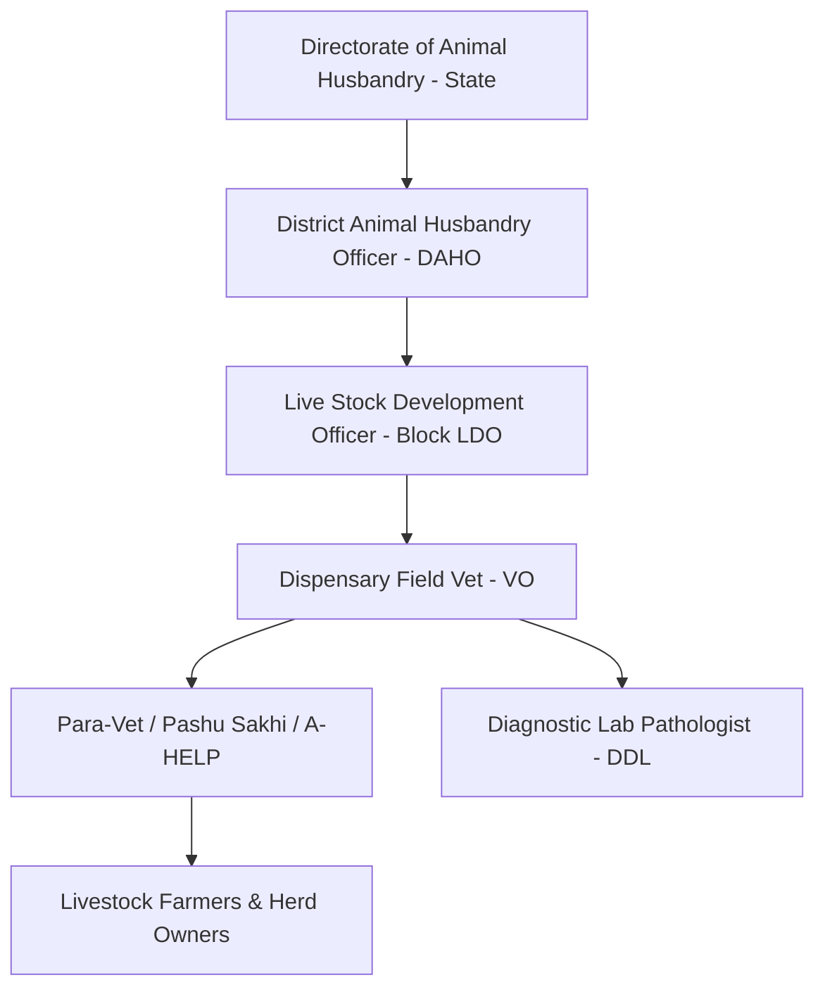
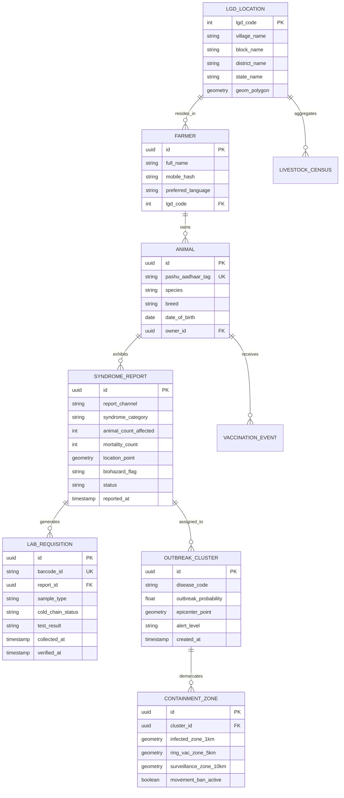

# Comprehensive Audit & Upgraded System Architecture: Livestock Health Surveillance & Decision-Support Solution (PRD v2.0)
**Document Status:** Final Production Specification & Architectural Audit  
**Target Problem Statement:** SIH Problem Statement ID 26128 (Department of Animal Husbandry & Dairying / Government of Maharashtra)  
**System Designation:** *Pashu-Suraksha (पशु सुरक्षा)* — National / State-level Real-Time Animal Disease Early Warning & Decision Support System  

---

## Executive Summary of the Audit

The initial research report (`deep-research-report.md`) provides a solid conceptual foundation by identifying core stakeholders (farmers, para-vets, veterinarians, laboratories, district officials) and aligning loosely with national initiatives like Bharat Pashudhan (NDLM) and ICAR-NIVEDI (NADRES).

However, an engineering and domain audit against the real-world operational challenges of rural India reveals **critical structural, clinical, and architectural gaps**. If built strictly according to the initial PRD, the system would suffer from:
1. **Clinical Inaccuracy & High False Positives:** Farmers cannot diagnose diseases; they only see non-specific symptoms. A simplistic text-based or naive rule engine triggers either rampant alert fatigue or missed early signals.
2. **Superficial Geospatial Intelligence:** Merely plotting village centroids on a map fails to detect statistically significant spatio-temporal outbreak clusters (e.g., Space-Time Permutation / SaTScan).
3. **Absence of a "One Health" Zoonotic Circuit Breaker:** Diseases such as Anthrax, Brucellosis, Rabies, and Avian Influenza pose mortal risks to humans. The initial report completely neglects automated inter-departmental escalation to human health authorities (IDSP / NCDC).
4. **Vague Offline Sync Architecture:** In remote tribal and rural belts where connectivity drops for days, a hand-waved "SQLite + REST queue" fails on conflict resolution, multi-tier data priorities, and photo payload management.
5. **No Containment & Closed-Loop Response Protocol:** Surveillance without automated containment action is useless. The system must automatically generate 1 km infected zone, 5 km containment ring, and 10 km surveillance buffers with biosecurity directives.

This document delivers a **rigorous section-by-section audit** followed by the **definitive PRD v2.0 and Engineering Specification** ready for implementation and hackathon victory.

---

# PART I: Rigorous Audit of `deep-research-report.md`

### 1. Feature & Scope Audit Matrix

| Dimension | Initial PRD Status | Field Reality & SIH Requirements | Severity / Gap Rating | Remediation in v2.0 |
|---|---|---|---|---|
| **Disease Taxonomy & Reporting** | Freeform text & generic symptoms | Farmers report observable syndromes (oral lesions, sudden death, skin nodules); need standardized syndromic ontology | 🔴 **Critical Gap** | Formalized 8-syndrome triage mapping to 13 ICAR-NIVEDI priority diseases with photo-guided questionnaire. |
| **Zoonotic Transmission Handling** | Mentioned only in passing | Anthrax, Brucellosis, and Bovine TB are life-threatening to handlers; opening an Anthrax carcass causes spore contamination. | 🔴 **Critical Gap** | Immediate "Biosecurity Red Alert" trigger: warns farmer NOT to open carcass, auto-notifies District Medical Officer (IDSP). |
| **Cluster Detection Algorithm** | Naive "3 deaths = alert" or simple heatmap | Outbreaks require spatio-temporal clustering (SaTScan / Space-Time DBSCAN) accounting for baseline animal density. | 🔴 **Critical Gap** | Integrated Spatio-Temporal Permutation Scan Statistic (SaTScan logic) running on PostGIS spatial geometry. |
| **Offline-First Synchronization** | Generic mention of SQLite & CommCare | Intermittent 2G networks drop large image uploads; conflicts arise when both para-vet and vet update case data. | 🟠 **Major Gap** | Two-phase delta sync: Priority 1 (JSON telemetry + symptoms < 2KB) synced immediately; Priority 2 (media) queued for WiFi/3G. CRDT / deterministic server-authority conflict resolution. |
| **Containment Actioning** | Reports displayed on dashboard | Officials need actionable tools: movement restrictions, ring vaccination radii, and police/panchayat advisories. | 🟠 **Major Gap** | Automated Dynamic Buffer Zone Generator (1 km Infected Zone, 5 km Ring Vaccination, 10 km Surveillance Zone). |
| **Diagnostic Lab Referral** | Basic status tracking (Sent -> Received) | Cold-chain maintenance (ice-pack shelf life 24-48 hrs), sample viability, barcode chain-of-custody, and Biosafety Level (BSL) routing. | 🟠 **Major Gap** | Cold-chain logistics tracker with transit countdown, QR code generation, and direct escalation upon positive PCR/ELISA confirmation. |
| **National Integration** | Mentions NDLM and NADRES | Lacks programmatic tie-in with 12-digit Pashu Aadhaar, Local Government Directory (LGD) codes, and 1962 MVU dispatch. | 🟡 **Moderate Gap** | Strict LGD hierarchical geographic coding (State -> District -> Block -> GP -> Village) and 12-digit RFID ear tag schema. |
| **Multilingual Voice / Conversational UI** | Basic IVR menu | High rural illiteracy; farmers struggle with complex IVR trees. | 🟡 **Moderate Gap** | Integration with Bhashini (AI speech-to-text for Indic languages), WhatsApp conversational bot with voice note parser. |

---

### 2. Deep Structural Breakdown of Deficiencies

#### Deficiency A: Symptom Ontology vs. Diagnostic Realism
- *Flaw in Initial PRD:* Line 135 models symptoms as `text symptoms` and expects farmers to report "foot-and-mouth disease".
- *Reality:* In Indian villages, farmers only recognize physical indicators: *laar girna* (hypersalivation), *langdaana* (lameness), *gaanthe nikalna* (skin nodules), *achanak maut* (sudden mortality), *khooni dast* (bloody diarrhea).
- *Solution:* Implement a **Syndromic Triage Decision Tree**. The UI prompts for observable primary signs (Species -> Primary Observable Syndrome -> Duration -> Number of Animals Affected).

#### Deficiency B: Spatial Analysis & False Alert Prevention
- *Flaw in Initial PRD:* Uses arbitrary thresholds ("mortality > 3 at same coordinate").
- *Reality:* A commercial dairy farm with 500 cattle losing 3 calves over a week is normal baseline mortality. However, 3 sheep dying in 48 hours in a tribal hamlet of 30 sheep is a catastrophic outbreak (e.g., Enterotoxaemia or PPR).
- *Solution:* Denominator-based thresholding: Risk score must normalize incident count against the **underlying livestock census** of that Local Government Directory (LGD) village unit.

#### Deficiency C: Failure to Address Post-Mortem Biosecurity (Anthrax Risk)
- *Flaw in Initial PRD:* Allows generic "sample collection" without bio-hazard quarantine warnings.
- *Reality:* If an animal dies suddenly with dark, unclotted blood oozing from natural orifices (suspected Anthrax), performing a routine post-mortem or taking an open tissue biopsy releases spores that contaminate the soil for 40+ years and can kill the farmer/vet.
- *Solution:* Rule zero in the triage engine: If sudden death + unclotted bleeding is reported, the system locks the case into **"ANTHRAX PROTOCOL - DO NOT OPEN CARCASS"**, pushes audio warnings to the farmer in their local dialect, and dispatches a specialized vet team with PPE.

---

# PART II: Architectural Upgrades & Strategic Framework

```
  +---------------------------------------------------------------------------------------------------+
  |                                     PASHU-SURAKSHA OMNI-CHANNEL INGESTION                         |
  |  +--------------------+  +----------------------+  +---------------------+  +------------------+  |
  |  | Offline PWA / App  |  | WhatsApp Voice Note  |  | 1962 Toll-Free IVR  |  | Web Portal (Vet) |  |
  |  | (Para-Vets/Farmers)|  | (Bhashini AI / Audio)|  | (DTMF + ASR)        |  | (Dispensaries)   |  |
  |  +---------+----------+  +----------+-----------+  +----------+----------+  +--------+---------+  |
  +------------|------------------------|-------------------------|----------------------|------------+
               |                        |                         |                      |
               +------------------------+------------+------------+----------------------+
                                                     |
                                                     v
                                      +-------------------------------+
                                      |   API Gateway & Auth (JWT)    |
                                      |   Rate Limiting & LGD Mapper  |
                                      +--------------+----------------+
                                                     |
               +-------------------------------------+-----------------------------------+
               |                                                                         |
               v                                                                         v
+-------------------------------+                                         +------------------------------+
|   SYNDROMIC TRIAGE ENGINE     |                                         |  SPATIO-TEMPORAL CLUSTERING  |
|  - 8 Clinical Syndrome Rules  |                                         |  - Space-Time SaTScan Logic  |
|  - Zoonotic Biohazard Flagging|                                         |  - PostGIS Density Ratio     |
|  - Denominator Normalization  |                                         |  - 1-5-10 km Ring Generator  |
+--------------+----------------+                                         +--------------+---------------+
               |                                                                         |
               +-------------------------------------+-----------------------------------+
                                                     |
                                                     v
                                      +-------------------------------+
                                      |   POSTGRESQL 16 + POSTGIS     |
                                      |  - Geometries (Points/Rings)  |
                                      |  - Animal Health Records      |
                                      |  - Lab Sample Chain-of-Custody|
                                      +--------------+----------------+
                                                     |
               +-------------------------------------+-----------------------------------+
               |                                                                         |
               v                                                                         v
+-------------------------------+                                         +------------------------------+
|   ESCALATION & ACTION ENGINE  |                                         |   SURVEILLANCE DASHBOARD     |
|  - SMS / WhatsApp Alerts      |                                         |  - GIS Live Incident Layers  |
|  - Ring Vaccination Orders    |                                         |  - Cold-Chain Lab Dispatch   |
|  - IDSP (Human Health) Notice |                                         |  - Epidemic Curves (Epi-Curve|
+-------------------------------+                                         +------------------------------+
```

### 1. The 8 Core Syndromic Surveillance Categories
To eliminate ambiguous reporting, all field entries map to standard syndromic buckets:

1. **Vesicular & Salivation Syndrome (VSS):** Blisters on snout, tongue, hooves; excessive salivation; refusal to eat. *(Suspect: FMD - Foot & Mouth Disease)*
2. **Nodular Skin Lesion Syndrome (NSLS):** Hard lumps on skin, high fever, swollen lymph nodes, edema in legs. *(Suspect: LSD - Lumpy Skin Disease)*
3. **Hyperacute Sudden Death Syndrome (HSDS):** Death within hours, dark unclotted blood from body openings, absence of rigor mortis. *(Suspect: Anthrax — HIGH ZOONOTIC ALERT)*
4. **Acute Respiratory & Oculonasal Syndrome (AROS):** High fever, discharge from eyes/nose, rapid breathing, painful grunting cough. *(Suspect: PPR in small ruminants / HS in bovines)*
5. **Crepitant Muscular Swelling Syndrome (CMSS):** Hot, painful swelling over shoulders/quarters that crackles under pressure, severe lameness, death in 24-48 hrs. *(Suspect: Black Quarter / BQ)*
6. **Storm Abortion & Reproductive Failure (SARF):** Late-term abortion in multiple animals, retained placenta, orchitis in males. *(Suspect: Brucellosis — HIGH ZOONOTIC ALERT)*
7. **Hemorrhagic Enteric Syndrome (HES):** Profuse, foul-smelling diarrhea with blood clots, severe dehydration, subnormal temperature before death. *(Suspect: Enterotoxaemia / Classical Swine Fever)*
8. **Neurological / Agitation Syndrome (NAS):** Circling, head pressing, aggression, paralysis, dysphagia (inability to swallow). *(Suspect: Rabies / Listeriosis — ZOONOTIC)*

---

# PART III: Upgraded Product Requirements Document (PRD v2.0)

## 1. System Stakeholders & Role-Based Access Control (RBAC)



- **Role 1: Smallholder Farmer / Livestock Owner**
  - *Channels:* Voice IVR (1962), WhatsApp Chatbot (Bhashini AI), Offline-capable Mobile App.
  - *Permissions:* Submit single/herd symptom report; receive triage advice & treatment updates; view vaccination schedule of tagged cattle.
- **Role 2: Para-Veterinary Worker / Pashu Sakhi / Gopal Mitra**
  - *Channels:* Offline-first Android/PWA app.
  - *Permissions:* Create verified field reports with GPS and photos; record vaccinations & treatments; initiate emergency SOS escalation.
- **Role 3: Field Veterinary Officer (VO - Dispensary Level)**
  - *Channels:* Mobile app + Web Portal.
  - *Permissions:* Clinical verification of cases; issue electronic prescriptions; generate lab sample requisitions with cold-chain barcoding; declare containment zones.
- **Role 4: Disease Diagnostic Laboratory (DDL / DIS) Technician**
  - *Channels:* Web Portal.
  - *Permissions:* Log sample receipt; verify cold-chain compliance; enter diagnostic test results (Rapid Antigen, ELISA, PCR); trigger lab-confirmed outbreak alerts.
- **Role 5: District Animal Husbandry Officer (DAHO) / State Surveillance Director**
  - *Channels:* Web GIS Command & Control Dashboard.
  - *Permissions:* Macro-level epidemiological analytics; declare ring vaccination campaigns; issue livestock market closure advisories; trigger cross-departmental One-Health alerts to District Magistrate & District Medical Officer.

---

## 2. Detailed Functional Specifications

### 2.1 Multi-Channel Ingestion & Syndromic Reporting
- **PWA & Mobile App:**
  - Photo-assisted symptom selector (farmers tap on intuitive illustrations or body maps of cow/buffalo/goat/pig/poultry).
  - Audio recording upload with auto-transcription via Government of India's **Bhashini API**.
  - Capture auto-GPS coordinates with accuracy metric (meters). Fallback to LGD dropdown hierarchy if GPS is disabled.
- **WhatsApp Conversational Bot:**
  - Integrated via WhatsApp Cloud API.
  - Farmer sends a photo or voice note saying: *"Meri bhains ke muh se jhaag nikal raha hai aur pair me chhale hain"* (My buffalo is salivating and has foot blisters).
  - Bhashini Speech-to-Text converts audio -> NLP categorizes to **Vesicular & Salivation Syndrome** -> Bot asks confirmation questions -> Creates ticket in Pashu-Suraksha.
- **1962 Helpline / IVR:**
  - Automated interactive voice response with DTMF fallback for non-smartphones.

### 2.2 Offline-First Sync Architecture
- **Local Storage:** IndexedDB / SQLite with encryption (AES-256).
- **Two-Phase Delta Synchronization:**
  1. *Priority 1 (Telemetry & Tele-triage JSON):* Case metadata, syndrome codes, GPS coordinates, animal count. Compressed payload (<2 KB). Synced over 2G/EDGE whenever a minimal socket handshake is established.
  2. *Priority 2 (Rich Media):* Lesion images and audio recordings. Compressed locally (WebP/Opus) and queued for opportunistic upload when 3G/4G/Wi-Fi is detected.
- **Conflict Resolution:** Server-authoritative timeline with client-side UUIDs (`UUIDv4`). Field edits generate an append-only event log (`Event Sourcing`) to prevent overwriting of historical veterinary notes.

### 2.3 Spatio-Temporal Outbreak Triage Engine

The triage engine functions in three tiers:

```
[ Tier 1: Real-time Rule Gateway (< 100ms) ]
  - Checks for Notifiable / Zoonotic Syndromes (Anthrax, Rabies, FMD).
  - Immediate Biosecurity Advisory dispatch.
             |
             v
[ Tier 2: Spatio-Temporal SaTScan / DBSCAN (< 5 sec) ]
  - Analyzes reports in a moving spatial window (Radius: 5 km, Time: 72 hours).
  - Normalizes case count against LGD village livestock population.
  - Generates Outbreak Probability Score (OPS):
      OPS = (Observed Cases / Expected Baseline) * Temporal Acceleration Factor * Weather Risk Weight
             |
             v
[ Tier 3: Environmental & Predictive Fusion (Periodic Batch / 6-hour) ]
  - Ingests IMD rainfall anomalies, humidity, and temperature.
  - Ingests MODIS NDVI (vegetation greenness) to model vector proliferation.
  - Predicts 14-day disease trajectory based on ICAR-NIVEDI epidemiological parameters.
```

### 2.4 Automated Outbreak Containment Protocol (Dynamic Buffer Generation)
When `OPS >= 0.75` or a case is **Lab-Confirmed**:
1. **Epicenter Determination:** Geographic centroid of reported cases.
2. **Buffer Generation (PostGIS `ST_Buffer`):**
   - **Infected Zone (0 - 1 km):** Complete livestock movement freeze. Daily clinical search. Immediate disposal of infected bedding/feed.
   - **Containment / Ring Vaccination Zone (1 - 5 km):** Target for emergency blanket ring-vaccination of all susceptible species within 72 hours.
   - **Surveillance Buffer Zone (5 - 10 km):** Strict monitoring of livestock markets (haats), check-posts on highways, weekly syndromic audit.
3. **Automated Notification Dispatch:**
   - Push notification to all registered farmers within 10 km radius with preventive measures.
   - Dispatch order sent to block Mobile Veterinary Unit (MVU).
   - Automated PDF memo drafted for DAHO to sign for the District Magistrate to ban livestock fairs.

### 2.5 Diagnostic Laboratory Referral & Cold-Chain Tracking
- **Electronic Lab Requisition Form (e-LRF):** Vet clicks "Refer to Lab" -> System generates unique QR code and sample tracking ID (`LRF-YYYYMMDD-XXXXX`).
- **Cold-Chain Guard:**
  - System captures collection timestamp and required preservation medium (e.g., *Glycerol saline for FMD viral swabs*, *EDTA for blood smears*, *Ice box maintaining 2-4°C*).
  - A countdown timer (48-hour SLA) begins. If the sample is not checked into the DDL within 36 hours, an alert is escalated to the District Lab Officer.
- **Closed-Loop Result Entry:**
  - Lab tech scans QR code -> selects Test Type (RT-PCR / Indirect ELISA / Giemsa Stain) -> enters Result (Positive / Negative / Inconclusive) + attaches diagnostic report PDF.
  - Positive result immediately updates case status to `LAB_CONFIRMED` and triggers Tier 1 alerts.

---

## 3. Complete Data Architecture & PostGIS Schema



### Production PostgreSQL / PostGIS DDL Implementation

```sql
-- Enable PostGIS extension
CREATE EXTENSION IF NOT EXISTS postgis;
CREATE EXTENSION IF NOT EXISTS "uuid-ossp";

-- 1. Administrative Hierarchy (Local Government Directory - LGD)
CREATE TABLE lgd_locations (
    lgd_code INT PRIMARY KEY,
    village_name VARCHAR(150) NOT NULL,
    block_name VARCHAR(150) NOT NULL,
    district_name VARCHAR(150) NOT NULL,
    state_name VARCHAR(100) NOT NULL,
    geom_boundary GEOMETRY(MultiPolygon, 4326),
    centroid GEOMETRY(Point, 4326) NOT NULL
);
CREATE INDEX idx_lgd_locations_centroid ON lgd_locations USING GIST(centroid);

-- 2. Baseline Livestock Census (for denominator normalization)
CREATE TABLE livestock_census (
    id SERIAL PRIMARY KEY,
    lgd_code INT REFERENCES lgd_locations(lgd_code),
    species VARCHAR(50) NOT NULL,
    total_population INT NOT NULL,
    census_year INT DEFAULT 2024
);
CREATE INDEX idx_census_lgd_species ON livestock_census(lgd_code, species);

-- 3. Farmer Registry
CREATE TABLE farmers (
    id UUID PRIMARY KEY DEFAULT uuid_generate_v4(),
    full_name VARCHAR(150) NOT NULL,
    mobile_hash CHAR(64) NOT NULL, -- SHA-256 for DPDP compliance
    mobile_last_four CHAR(4) NOT NULL,
    preferred_language VARCHAR(20) DEFAULT 'marathi',
    lgd_code INT REFERENCES lgd_locations(lgd_code),
    created_at TIMESTAMP WITH TIME ZONE DEFAULT CURRENT_TIMESTAMP
);

-- 4. Animal Registry (NDLM Pashu Aadhaar)
CREATE TABLE animals (
    id UUID PRIMARY KEY DEFAULT uuid_generate_v4(),
    pashu_aadhaar_tag VARCHAR(12) UNIQUE, -- 12-digit RFID ear tag
    species VARCHAR(50) NOT NULL, -- Cattle, Buffalo, Sheep, Goat, Pig
    breed VARCHAR(100),
    sex VARCHAR(10) CHECK (sex IN ('Male', 'Female')),
    date_of_birth DATE,
    owner_id UUID REFERENCES farmers(id),
    is_active BOOLEAN DEFAULT TRUE,
    created_at TIMESTAMP WITH TIME ZONE DEFAULT CURRENT_TIMESTAMP
);
CREATE INDEX idx_animals_tag ON animals(pashu_aadhaar_tag);

-- 5. Syndromic Disease Reports
CREATE TYPE report_status AS ENUM ('SUBMITTED', 'TRIAGED', 'VET_VERIFIED', 'LAB_REFERRED', 'RESOLVED', 'FALSE_ALARM');
CREATE TYPE biohazard_level AS ENUM ('NONE', 'SUSPECTED_ZOONOTIC', 'CRITICAL_ANTHRAX_LOCK');

CREATE TABLE syndrome_reports (
    id UUID PRIMARY KEY DEFAULT uuid_generate_v4(),
    reporter_type VARCHAR(30) NOT NULL, -- FARMER, PARA_VET, VET, CALL_CENTER_1962
    reporter_id UUID NOT NULL,
    animal_id UUID REFERENCES animals(id), -- Nullable for flock/herd reports
    species VARCHAR(50) NOT NULL,
    syndrome_category VARCHAR(10) NOT NULL, -- VSS, NSLS, HSDS, AROS, CMSS, SARF, HES, NAS
    primary_symptoms TEXT[] NOT NULL,
    animal_count_susceptible INT DEFAULT 1,
    animal_count_affected INT NOT NULL DEFAULT 1,
    mortality_count INT NOT NULL DEFAULT 0,
    location_point GEOMETRY(Point, 4326) NOT NULL,
    lgd_code INT REFERENCES lgd_locations(lgd_code),
    image_urls TEXT[],
    audio_note_url TEXT,
    biohazard_flag biohazard_level DEFAULT 'NONE',
    risk_score FLOAT CHECK (risk_score >= 0.0 AND risk_score <= 1.0),
    status report_status DEFAULT 'SUBMITTED',
    created_at TIMESTAMP WITH TIME ZONE DEFAULT CURRENT_TIMESTAMP,
    updated_at TIMESTAMP WITH TIME ZONE DEFAULT CURRENT_TIMESTAMP
);
CREATE INDEX idx_syndrome_reports_spatial ON syndrome_reports USING GIST(location_point);
CREATE INDEX idx_syndrome_reports_time ON syndrome_reports(created_at);
CREATE INDEX idx_syndrome_reports_syndrome ON syndrome_reports(syndrome_category);

-- 6. Spatio-Temporal Outbreak Clusters
CREATE TABLE outbreak_clusters (
    id UUID PRIMARY KEY DEFAULT uuid_generate_v4(),
    cluster_code VARCHAR(50) UNIQUE NOT NULL,
    suspected_disease VARCHAR(100) NOT NULL,
    outbreak_probability FLOAT NOT NULL,
    epicenter GEOMETRY(Point, 4326) NOT NULL,
    radius_meters FLOAT NOT NULL,
    case_count INT NOT NULL,
    mortality_count INT NOT NULL,
    alert_level VARCHAR(20) CHECK (alert_level IN ('WATCH', 'WARNING', 'OUTBREAK_DECLARED')),
    detected_at TIMESTAMP WITH TIME ZONE DEFAULT CURRENT_TIMESTAMP,
    is_active BOOLEAN DEFAULT TRUE
);
CREATE INDEX idx_outbreak_clusters_spatial ON outbreak_clusters USING GIST(epicenter);

-- 7. Automated Containment Zones
CREATE TABLE containment_zones (
    id UUID PRIMARY KEY DEFAULT uuid_generate_v4(),
    cluster_id UUID REFERENCES outbreak_clusters(id) ON DELETE CASCADE,
    infected_zone GEOMETRY(Polygon, 4326) NOT NULL, -- 1 km buffer
    containment_zone GEOMETRY(Polygon, 4326) NOT NULL, -- 5 km buffer
    surveillance_zone GEOMETRY(Polygon, 4326) NOT NULL, -- 10 km buffer
    movement_ban_issued BOOLEAN DEFAULT FALSE,
    issued_at TIMESTAMP WITH TIME ZONE DEFAULT CURRENT_TIMESTAMP
);

-- 8. Diagnostic Lab Chain-of-Custody
CREATE TABLE lab_requisitions (
    id UUID PRIMARY KEY DEFAULT uuid_generate_v4(),
    barcode_id VARCHAR(50) UNIQUE NOT NULL,
    report_id UUID REFERENCES syndrome_reports(id),
    sample_type VARCHAR(100) NOT NULL, -- Whole Blood, Serum, Nasal Swab, Vesicular Epithelium, Milk
    preservative_used VARCHAR(100),
    collected_by UUID NOT NULL, -- Vet ID
    collected_at TIMESTAMP WITH TIME ZONE NOT NULL,
    cold_chain_breached BOOLEAN DEFAULT FALSE,
    received_at_lab TIMESTAMP WITH TIME ZONE,
    lab_technician_id UUID,
    test_method VARCHAR(100), -- PCR, ELISA, RT-PCR, Slide Microscopy
    test_result VARCHAR(50) CHECK (test_result IN ('PENDING', 'POSITIVE', 'NEGATIVE', 'INCONCLUSIVE')),
    result_notes TEXT,
    verified_at TIMESTAMP WITH TIME ZONE
);
CREATE INDEX idx_lab_requisitions_barcode ON lab_requisitions(barcode_id);

-- 9. Vaccination Records & Coverage Tracking
CREATE TABLE vaccination_records (
    id UUID PRIMARY KEY DEFAULT uuid_generate_v4(),
    animal_id UUID REFERENCES animals(id),
    pashu_aadhaar_tag VARCHAR(12),
    vaccine_name VARCHAR(100) NOT NULL, -- FMD-Oil Adjuvant, Raksha-LSD, Anthrax Spore
    batch_number VARCHAR(50) NOT NULL,
    administered_date DATE NOT NULL,
    next_due_date DATE NOT NULL,
    administered_by UUID NOT NULL,
    campaign_id VARCHAR(50),
    lgd_code INT REFERENCES lgd_locations(lgd_code)
);
CREATE INDEX idx_vac_records_animal ON vaccination_records(animal_id);
CREATE INDEX idx_vac_records_lgd ON vaccination_records(lgd_code);
```

---

## 4. Production REST & WebSocket API Specification

### Endpoint 1: Ingest Syndromic Report (Offline Sync Compatible)
`POST /api/v1/surveillance/reports`
- **Headers:** `Authorization: Bearer <JWT>`, `X-Client-Sync-ID: <UUID>`
- **Request Payload:**
```json
{
  "sync_client_id": "7c9e6679-7425-40de-944b-e07fc1f90ae7",
  "reporter_type": "PARA_VET",
  "reporter_id": "9b1deb4d-3b7d-4bad-9bdd-2b0d7b3dcb6d",
  "species": "Cattle",
  "animal_tag": "370019284712",
  "syndrome_category": "VSS",
  "primary_symptoms": [
    "hyper_salivation",
    "vesicles_on_tongue",
    "coronary_band_lesions"
  ],
  "animal_count_susceptible": 45,
  "animal_count_affected": 8,
  "mortality_count": 0,
  "location": {
    "latitude": 19.8762,
    "longitude": 75.3433,
    "gps_accuracy_meters": 4.2
  },
  "lgd_code": 558291,
  "media_payload": {
    "has_image": true,
    "image_base64_thumbnail": "data:image/webp;base64,...",
    "full_image_sync_deferred": true
  },
  "timestamp": "2026-08-29T07:30:00Z"
}
```
- **Response Payload (201 Created):**
```json
{
  "success": true,
  "server_report_id": "f47ac10b-58cc-4372-a567-0e02b2c3d479",
  "triage_summary": {
    "suspected_disease": "Foot and Mouth Disease (FMD)",
    "risk_score": 0.88,
    "biohazard_level": "NONE",
    "cluster_flag": "WATCH",
    "immediate_advisory": "Isolate affected animals immediately. Wash oral lesions with 1% potassium permanganate solution. Restrict herd movement outside shed."
  },
  "containment_orders": {
    "buffer_active": false,
    "nearest_veterinary_dispensary": "Shevgaon Taluka Polyclinic (4.3 km away)"
  }
}
```

### Endpoint 2: Real-time Spatio-Temporal Clusters Query
`GET /api/v1/surveillance/clusters?district=Ahmednagar&time_window_days=7`
- **Response Payload (200 OK):**
```json
{
  "timestamp": "2026-08-29T07:35:00Z",
  "active_clusters_count": 1,
  "clusters": [
    {
      "cluster_id": "CL-MH-AHM-2026-004",
      "disease": "Lumpy Skin Disease",
      "alert_level": "OUTBREAK_DECLARED",
      "outbreak_probability": 0.94,
      "epicenter": {
        "latitude": 19.0948,
        "longitude": 74.7480
      },
      "radius_meters": 4800,
      "stats": {
        "villages_affected": 4,
        "total_cases": 42,
        "total_mortalities": 3,
        "population_at_risk": 3200
      },
      "containment_geojson": {
        "type": "FeatureCollection",
        "features": [
          {
            "type": "Feature",
            "properties": { "zone": "INFECTED_1KM", "color": "#dc2626" },
            "geometry": { "type": "Polygon", "coordinates": [[[74.74, 19.09], "..."]] }
          },
          {
            "type": "Feature",
            "properties": { "zone": "RING_VACCINATION_5KM", "color": "#f59e0b" },
            "geometry": { "type": "Polygon", "coordinates": [[[74.70, 19.05], "..."]] }
          }
        ]
      }
    }
  ]
}
```

### Endpoint 3: Lab Requisition Cold-Chain Handshake
`PUT /api/v1/lab/sample-intake/{barcode_id}`
- **Request Payload:**
```json
{
  "received_at_lab": "2026-08-29T07:40:00Z",
  "lab_technician_id": "4a1b0213-39ee-4737-a9a3-5c58a69e718b",
  "temperature_on_arrival_celsius": 3.8,
  "is_cold_chain_intact": true,
  "initial_inspection": "ACCEPTED_FOR_PCR"
}
```

---

## 5. Spatio-Temporal SaTScan / DBSCAN Clustering Logic

The platform implements an automated Space-Time Permutation algorithm executed directly on PostGIS every 30 minutes or upon any `HIGH_RISK` report:

```python
# Pseudo-implementation of Spatial Cluster Detection Engine
def evaluate_spatio_temporal_outbreak(new_report, db_session):
    """
    Evaluates whether an incoming syndromic report triggers or joins
    an active outbreak cluster.
    """
    RADIUS_METERS = 5000  # 5 km spatial window
    TIME_WINDOW_DAYS = 3  # 72 hours temporal window
    
    # 1. Query co-located reports of the same syndromic category
    cluster_query = f"""
        SELECT 
            COUNT(*) as case_count,
            SUM(animal_count_affected) as total_animals_affected,
            SUM(mortality_count) as total_deaths,
            ST_AsGeoJSON(ST_Centroid(ST_Collect(location_point))) as center_point,
            array_agg(DISTINCT lgd_code) as affected_villages
        FROM syndrome_reports
        WHERE syndrome_category = '{new_report.syndrome_category}'
          AND ST_DWithin(location_point, ST_SetSRID(ST_Point({new_report.longitude}, {new_report.latitude}), 4326), {RADIUS_METERS})
          AND created_at >= NOW() - INTERVAL '{TIME_WINDOW_DAYS} DAYS'
    """
    result = db_session.execute(cluster_query).fetchone()
    
    # 2. Get baseline census denominator for affected villages
    census_query = f"""
        SELECT COALESCE(SUM(total_population), 1) as total_census
        FROM livestock_census
        WHERE lgd_code = ANY(ARRAY{result.affected_villages})
          AND species = '{new_report.species}'
    """
    census = db_session.execute(census_query).fetchone()
    
    # 3. Calculate Attack Rate & Outbreak Probability Score (OPS)
    attack_rate = (result.total_animals_affected / census.total_census) * 100
    mortality_rate = (result.total_deaths / max(result.total_animals_affected, 1)) * 100
    
    # An attack rate > 1.5% in 72 hours or > 2 deaths triggers OUTBREAK status
    if attack_rate > 1.5 or result.total_deaths >= 2:
        alert_status = "OUTBREAK_DECLARED"
        ops_score = min(0.70 + (attack_rate * 0.05), 0.99)
        
        # Trigger automated PostGIS 1km, 5km, 10km buffers
        generate_containment_buffers(result.center_point, db_session)
        dispatch_ring_vaccination_alert(result.center_point, new_report.syndrome_category)
    elif result.total_animals_affected >= 3:
        alert_status = "WARNING"
        ops_score = 0.55
    else:
        alert_status = "WATCH"
        ops_score = 0.25
        
    return {
        "status": alert_status,
        "ops_score": ops_score,
        "cases": result.total_animals_affected,
        "deaths": result.total_deaths
    }
```

---

## 6. One-Health & Zoonotic Transmission Safeguard Engine

A standout feature that directly satisfies the problem statement's prompt: *"raise the risk of zoonotic transmission"*.

```
[ Incoming Report with Zoonotic Syndrome ]
                  |
        +---------+---------+
        |                   |
[ Anthrax Suspect ]   [ Brucellosis / Rabies ]
        |                   |
        v                   v
+------------------+  +------------------+
| EMERGENCY LOCK   |  | ZOONOTIC ALERT   |
| Dispatches PPE   |  | Sends Hygiene    |
| & Safe Disposal  |  | Warnings         |
+--------+---------+  +--------+---------+
         |                     |
         +----------+----------+
                    |
                    v
  +-------------------------------------+
  | AUTOMATED IDSP INTER-AGENCY BRIDGE  |
  | Sends Encrypted JSON to:            |
  | 1. District Surveillance Officer    |
  |    (Human Health / Integrated       |
  |     Disease Surveillance Programme) |
  | 2. District Collector / Magistrate  |
  | 3. Local Primary Health Center(PHC) |
  +-------------------------------------+
```

1. **Anthrax Protocol (Zero-Necropsy Rule):**
   - If `syndrome_category == 'HSDS'` (Hyperacute Sudden Death with unclotted bleeding), the system initiates an immediate visual lock on the app.
   - Farmer receives an emergency voice prompt in Marathi/Hindi: *"चेतावणी: जनावराला हात लावू नका किंवा कापू नका. रोग मानवात पसरू शकतो."* (Warning: Do not touch or cut the animal. Disease spreads to humans).
   - Direct SMS dispatch to Primary Health Centre (PHC) Medical Officer within that block to monitor local human handlers for cutaneous anthrax lesions.
2. **Brucellosis Milk & Abortion Warning:**
   - Alerts dairy handlers to boil milk immediately and dispose of aborted fetal membranes wearing rubber gloves and bleaching powder.

---

# PART IV: Smart India Hackathon (SIH) Winning Blueprint

### 1. The 36-Hour Hackathon Implementation Strategy

To deliver a working prototype that wows jury members, build the system with high-velocity, production-tested components:

| Layer | Recommended Technology Stack | Justification for SIH Winning Demo |
|---|---|---|
| **Frontend / PWA** | **React 18 + Vite + Tailwind CSS + Lucide Icons** | Ultra-responsive, mobile-first, offline PWA with service workers, instant load time. |
| **Mapping Engine** | **MapLibre GL JS / Leaflet + OpenStreetMap** | Vector tile rendering, smooth GeoJSON polygon animation for 1km/5km rings, zero API cost. |
| **Backend API** | **FastAPI (Python 3.11)** | High-speed asynchronous Python, native Pydantic validation, seamless execution of ML/spatial code. |
| **Spatial Database** | **PostgreSQL 16 with PostGIS 3.4** | True spatial queries (`ST_DWithin`, `ST_Buffer`, `ST_Centroid`), robust ACID transactions. |
| **Voice & Multilingual** | **Bhashini API / Web Speech API + Mock Audio Fallback** | Instant demonstration of Hindi/Marathi voice-to-symptom triage. |
| **Notifications** | **Twilio / Textlocal / Mock SMS Gateway** | Broadcast realistic alerts to jury members' phones during the live pitch. |

---

### 2. Live Demo Script for SIH Presentation (Minute-by-Minute)

**Total Time: 7 Minutes (4 Min Pitch + 3 Min Live Interaction)**

#### Minute 0:00 - 1:00 | The Hook & Ground Reality
- *Presenter:* "Respected Judges, India loses ₹30,000 Crores annually to Foot-and-Mouth Disease, Lumpy Skin Disease, and Anthrax. Why? Because a farmer in a remote village in Ahmednagar notices blisters on his cow on Monday, but the district vet finds out only next Friday when 15 cows have died. We present **Pashu-Suraksha**, the real-time digital watchtower for livestock health."

#### Minute 1:00 - 2:30 | The Farmer Journey (Offline & Voice AI)
- *Demo on Mobile:* Disconnect the laptop/phone Wi-Fi to simulate zero network.
- Open the **Pashu-Suraksha PWA**. Show audio reporting: The presenter speaks in Hindi/Marathi: *"गाय को 3 दिन से तेज बुखार है, मुंह से लार गिर रही है और पैरों में छाले हैं।"*
- Show that the app categorizes this as **Vesicular & Salivation Syndrome (FMD Suspect)** and logs the exact GPS coordinate offline.
- Turn Wi-Fi back on. The app shows: *"Network Restored: Syncing 1 Encrypted Telemetry Record (1.4 KB)"*.

#### Minute 2:30 - 4:00 | Real-Time Triage & Dynamic Ring Containment
- Switch screen to the **District Veterinary Officer Command Dashboard**.
- Instantly, an audio-visual alert pops up: **"HIGH RISK OUTBREAK ALERT - Ahmednagar Block"**.
- Show the MapLibre map: A bright red pulsating epicenter appears at the village.
- Click the button: **"Generate Containment Buffer"**.
- Watch the system dynamically render:
  - Red Polygon (1 km): *Infected Movement Freeze Zone*
  - Orange Polygon (5 km): *Emergency Ring Vaccination Zone (3,400 Cattle Target)*
  - Yellow Polygon (10 km): *Surveillance & Haat Restriction Zone*
- Show the **One-Health Button**: A one-click dispatch sends an automated advisory to the District Human Health Officer (IDSP).

#### Minute 4:00 - 5:30 | Closed-Loop Lab Referral & Cold-Chain Tracking
- Click "Refer to District Diagnostic Lab". A QR code requisition is created with a 48-hour cold-chain shelf-life countdown.
- Log into the Lab Portal. Scan the QR code, mark result as **FMD Positive (RT-PCR)**.
- The entire dashboard updates to **LAB_CONFIRMED**. A simulated SMS broadcast is triggered to 250 registered farmers within 5 km: *"Alert: FMD confirmed in your village. Ring vaccination drive starting tomorrow at GP Office."*

#### Minute 5:30 - 7:00 | Architectural Superiority & Jury Q&A
- Show the PostGIS spatial query performance, LGD hierarchy integration, and DPDP Act compliance (SHA-256 hashed phone numbers).
- Highlight the ROI: How cutting detection lag from 7 days to under 6 hours saves livestock, protects human health, and prevents village-level economic devastation.

---

### 3. Key Differentiators that Win Hackathons

1. **Beyond "Pins on a Map":** Almost every other team will show Google Maps with basic red and green pins. You show **mathematical spatial clustering** (SaTScan) and **automated 1-5-10 km containment geometry**.
2. **Biosecurity & Zoonotic Focus (One Health):** You are the only team demonstrating an automated inter-agency bridge to the National Centre for Disease Control (NCDC / IDSP) to stop diseases from jumping to humans.
3. **Genuine Offline-First Capability:** Demonstrating the demo live with airplane mode turned on proves you understand rural infrastructure.
4. **Integration with Bharat Pashudhan (NDLM):** Using 12-digit Pashu Aadhaar tags and LGD codes proves this system is ready for official government deployment, not just an academic prototype.

---

## 5. Next Steps & Recommended Action Plan

1. **Review this Document:** Read through both the Audit (Part I) and Upgraded Architecture (Parts II-IV).
2. **Review the Complete Codebase:** In the following steps, we can generate:
   - Complete FastAPI Backend with PostGIS integration and triage endpoints.
   - Modern React/Vite/Tailwind frontend dashboard with interactive MapLibre GL containment rings.
   - Offline-first Service Worker with IndexedDB sync.
   - Comprehensive documentation and pitch deck slides.
