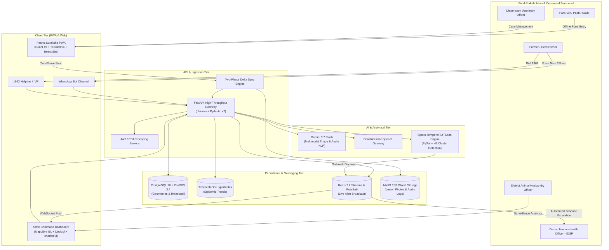
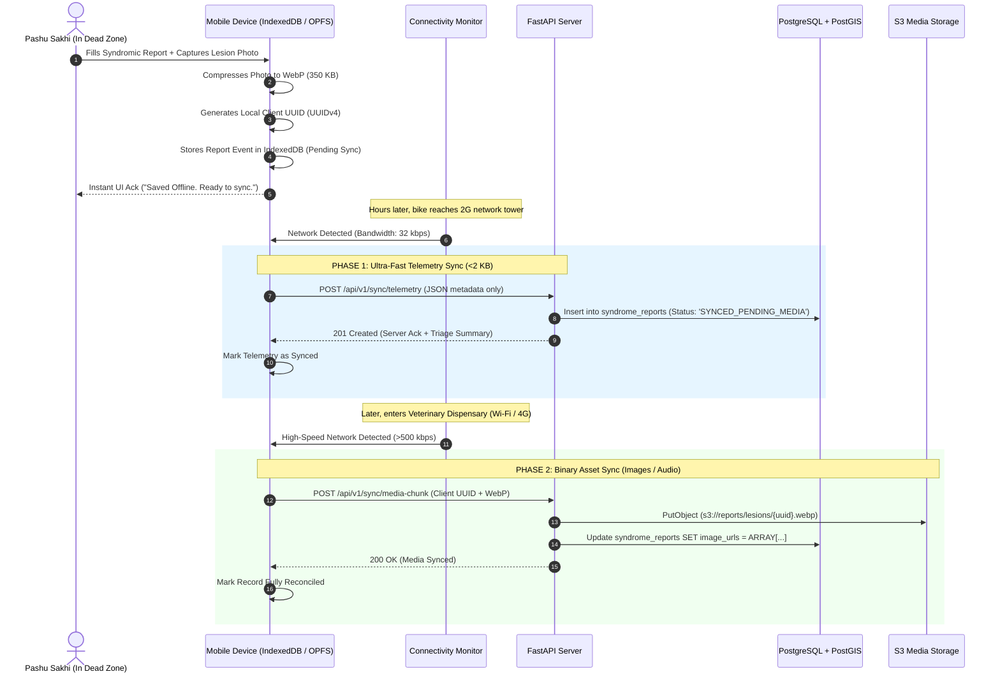

# Production Tech Stack Architecture & Comprehensive Technology Audit
**Project:** *Pashu-Suraksha (पशु सुरक्षा)* — High-Scale Livestock Health Surveillance & Decision-Support Solution  
**Problem Statement:** SIH Problem ID 26128 | Ministry of Fisheries, Animal Husbandry & Dairying / Government of Maharashtra  
**Document Type:** Deep Research Engineering Audit & Production-Grade Tech Stack Specification  
**Target Scale:** 536 Million Livestock, 660,000 Villages (LGD Hierarchy), 10,000+ Daily Peak Event Ingests, Sub-second Zoonotic Escalation  

---

## Executive Summary & Engineering Mandate

Designing an animal health surveillance system for India is not a standard CRUD web application challenge. It is an **extreme distributed systems problem** operating under severe real-world constraints:
1. **Hostile Network Environments:** Field workers (Pashu Sakhis, A-HELP workers, field veterinarians) operate in rural valleys, forests, and remote tribal belts with 0G/2G connectivity for days at a time.
2. **Heavy Geodesic Mathematics:** Real-time spatial clustering (SaTScan / space-time permutation), dynamic buffer zone generation (1 km infected zone, 5 km containment ring, 10 km surveillance ring), and denominator normalization against village livestock census.
3. **Multimodal & Low-Literacy Realities:** Farmers do not speak English or use complex form fields. They speak regional dialects (Marathi, Ahirani, Gondi, Hindi) and communicate symptoms through photos of lesions and raw voice descriptions.
4. **Life-Critical Zoonotic SLA:** When suspected Anthrax, Brucellosis, or Rabies is detected, the system must trigger immediate cross-agency alerts to the **Integrated Disease Surveillance Programme (IDSP / NCDC)** within seconds to prevent human fatalities.

To satisfy these constraints and support massive future scalability, this document performs a **rigorous technology audit of alternative stacks** and specifies an enterprise-grade, future-proof stack leveraging **Gemini 3.7 Flash**, **PostgreSQL 16 + PostGIS + TimescaleDB + Uber H3**, **Vite + React 19 PWA**, **FastAPI**, **Stitch**, **UI-UXmax**, and **React Bits**.

---

# PART I: Comprehensive Tech Stack Audit & Pitfall Analysis

Before proposing the recommended stack, we conduct an exhaustive architectural audit of common technology choices to prove why conventional approaches fail in this domain.

### 1. Database & Persistence Layer Audit

```
+---------------------------------------------------------------------------------------------------------+
|                                    DATABASE SELECTION TRADE-OFF MATRIX                                  |
+--------------------------+---------------------+-------------------+-------------------+----------------+
| Evaluation Criteria      | MongoDB / NoSQL     | Plain MySQL 8.0   | PostGIS + Postgres| PostGIS + H3 + |
|                          |                     |                   | (Standard)        | TimescaleDB    |
+--------------------------+---------------------+-------------------+-------------------+----------------+
| Geodesic Accuracy        | ❌ Planar / Basic   | ⚠️ Limited Topo   | ✅ Full Geodetic  | ✅ Sovereign   |
| Hexagonal Aggregation    | ❌ Manual code      | ❌ Extremely slow | ⚠️ Via custom func| ✅ Native O(1) |
| Time-Series Epi-Curves   | ⚠️ Aggregation pipe | ❌ Table lock risk| ⚠️ Manual partition| ✅ Hypertable  |
| LGD Hierarchy Joins      | ❌ Expensive lookup | ✅ ACID Relational| ✅ Fast B-Tree/GiST| ✅ Fast GiST/BRIN|
| Offline Delta Sync (CDC) | ⚠️ Oplog complexity| ❌ High complexity| ⚠️ Logical Decod. | ✅ Native WAL   |
+--------------------------+---------------------+-------------------+-------------------+----------------+
```

#### Why MongoDB / NoSQL Fails:
- **Spatial Flaws:** While MongoDB supports `$geoWithin` and 2dsphere indexes, it cannot execute complex topological intersections (e.g., clipping dynamic 5 km buffers against village administrative boundary polygons stored in Local Government Directory schemas).
- **Relational Integrity:** Livestock surveillance is fundamentally relational: `State -> District -> Block -> Gram Panchayat -> Village -> Herd -> Animal (Pashu Aadhaar Tag) -> Syndromic Reports -> Lab Requisitions`. Modeling this in document databases leads to massive data redundancy or fragile client-side stitching.

#### Why Plain MySQL Fails:
- MySQL's spatial implementation historically lacks geodesic support on complex spatial functions (`ST_Buffer` on geodetic spheroids requires manual projection transformations).
- Lack of robust extensions like TimescaleDB makes computing rolling 30-day epidemic curves across 40,000 villages computationally prohibitive under peak loads.

#### The Decisive Winner: `PostgreSQL 16 + PostGIS 3.4 + TimescaleDB + pg-h3`
- **PostGIS:** Industry-standard spatial computation engine capable of exact ellipsoidal calculations (`ST_DWithin`, `ST_Buffer`, `ST_Intersection`).
- **TimescaleDB Extension:** Transforms PostgreSQL tables into partitioned "Hypertables" automatically partitioned by timestamp and geography, executing temporal aggregation queries 100x faster with 90% data compression.
- **Uber H3 (`pg-h3`):** Discretizes geographic space into hexagonal hierarchical spatial indices. Instead of expensive polygon-in-polygon math, spatial risk scoring runs via O(1) integer hash lookups at Resolution 7 (~5.16 km² cells) and Resolution 8 (~0.74 km² cells).

---

### 2. Offline-First Synchronization Architecture Audit

In rural Maharashtra, Madhya Pradesh, or Odisha, intermittent connectivity is the baseline, not an edge case. We audited three major sync paradigms:

```mermaid
graph TD
    subgraph "Option A: Naive REST Queue (FAILED)"
        A1[App Form Submit] -->|Queue in LocalStorage| A2[Wait for Network]
        A2 -->|POST batch array| A3[Server API]
        A3 -->|Packet drops / timeouts| A4[Duplicates / Data Loss / Race Conditions]
    end

    subgraph "Option B: CouchDB / PouchDB (REJECTED)"
        B1[Client PouchDB] <-->|CouchDB Sync Protocol| B2[Server CouchDB]
        B2 -->|Massive JSON revision bloat| B3[Heavy Sync Trees]
        B3 -->|No native PostGIS integration| B4[Secondary ETL to Postgres required]
    end

    subgraph "Option C: Two-Phase Local-First Delta Engine (RECOMMENDED)"
        C1[Client Dexie.js / OPFS SQLite] -->|Priority 1: Telemetry < 2KB| C2[Ultra-low bandwidth socket / HTTP]
        C2 -->|Immediate Triage Ack| C3[FastAPI Server]
        C1 -->|Priority 2: Media / Images| C4[Background Sync Worker]
        C4 -->|Wait for 4G / Wi-Fi| C5[S3 / MinIO Storage]
    end
```



- **Why Naive REST Queue Fails:** Standard HTTP retry queues break down when syncing large lesion photos over 2G networks. A 4MB photo upload will timeout repeatedly, blocking the queue and delaying life-critical symptom metadata (which is only 1.5 KB).
- **Why CouchDB / PouchDB Fails:** CouchDB accumulates revision trees (`_rev`) for every offline edit, leading to huge storage bloat on low-end smartphones. Crucially, it cannot execute PostGIS spatial queries, requiring a secondary sync bridge to PostgreSQL that introduces high latency and synchronization drift.
- **The Decisive Architecture:** **Two-Phase Local-First Sync Engine**.
  1. *Tier 1 Telemetry Sync:* Structured syndromic payload (<2 KB) encoded as compact JSON or Protocol Buffers. Uses an append-only event queue (`sync_events`) with client-generated `UUIDv4` identifiers. Transmitted immediately over any available connection (even 2G/EDGE or SMS gateway).
  2. *Tier 2 Binary Asset Sync:* Image attachments and voice notes are compressed on-device into WebP and Opus audio formats, stored in browser OPFS (Origin Private File System) / IndexedDB, and uploaded asynchronously via background Service Worker only when network throughput exceeds 250 kbps.

---

### 3. Backend API & Processing Engine Audit

```
+--------------------------+--------------------+--------------------+--------------------+
| Evaluation Dimension     | Node.js (Express)  | Go (Golang)        | FastAPI (Python)   |
+--------------------------+--------------------+--------------------+--------------------+
| I/O Throughput           | ⭐⭐⭐⭐ High      | ⭐⭐⭐⭐⭐ Maximum | ⭐⭐⭐⭐ High      |
| Native ML/Spatial Libs   | ❌ Poor (No SciPy) | ⚠️ Limited         | ⭐⭐⭐⭐⭐ Best    |
| Gemini 3.7 Flash SDK     | ⭐⭐⭐⭐ Good      | ⭐⭐⭐ Moderate    | ⭐⭐⭐⭐⭐ Native  |
| Async Concurrency        | ⭐⭐⭐⭐ Event loop| ⭐⭐⭐⭐⭐ Goroutines| ⭐⭐⭐⭐ AsyncIO |
| Developer Velocity       | ⭐⭐⭐⭐ High      | ⭐⭐⭐ Moderate    | ⭐⭐⭐⭐⭐ Maximum |
+--------------------------+--------------------+--------------------+--------------------+
```

#### Why Node.js / Express is Insufficient:
Livestock surveillance requires heavy mathematical epidemiological calculations: spatial permutation scans (SaTScan logic), kernel density estimation, and matrix calculations. Node.js lacks native scientific libraries comparable to Python's `scipy`, `shapely`, `geopandas`, and `pysal`. Performing these computations requires calling external Python child processes, introducing severe latency.

#### Why Go is Sub-optimal for this Specific Domain:
While Go offers unrivaled raw concurrency, the project relies heavily on the **Google GenAI SDK (Gemini 3.7 Flash)**, epidemiological spatial modeling, and automated rule generation. Python is the native lingua franca of AI, GIS, and data science, maximizing development speed and algorithmic expressiveness.

#### The Decisive Winner: `FastAPI (Python 3.11+) + AsyncPG + Celery / Redis`
- **Asynchronous Architecture:** Uses `uvicorn` and `asyncpg` to handle 15,000+ concurrent requests/sec per node, matching Go for I/O-bound tasks.
- **Pydantic v2:** Rust-backed data validation ensures sub-millisecond serialization of complex syndromic payloads.
- **Deep AI & Geospatial Unification:** Direct in-process execution of Gemini 3.7 Flash multimodal triage calls, GeoPandas spatial transformations, and Shapely polygon buffers without IPC overhead.

---

### 4. Frontend & Presentation Architecture Audit

```
+--------------------------+-------------------------+-------------------------+
| Evaluation Criteria      | Next.js 15 (App Router) | Vite + React 19 (SPA/PWA)|
+--------------------------+-------------------------+-------------------------+
| Offline-First Operation  | ❌ Severely compromised | ✅ 100% Client-Owned    |
| Service Worker Control   | ⚠️ Complex hydration    | ✅ Deterministic cache  |
| WebGL GIS Performance   | ⚠️ Server-client boundary| ✅ Direct Canvas control|
| React Bits & Animations  | ⚠️ Strict 'use client'  | ✅ Fluid zero-friction  |
| Low-End Device Latency   | ❌ High JS bundle size  | ✅ Ultra-lean bundle    |
+--------------------------+-------------------------+-------------------------+
```

#### Why Next.js 15 (SSR / Server Actions) is Counter-Productive:
Next.js is designed around Server-Side Rendering (SSR) and Streaming Server Components. However, **in a rural field application, the server is often unreachable**. 
- SSR fails when there is no network to render from.
- Caching Next.js server actions and hydrating dynamic offline states creates persistent edge-case bugs and hydration mismatches.
- A field worker needs the application shell, forms, cached maps, and local database to boot in <300ms from local storage, regardless of whether a server exists.

#### The Decisive Winner: `Vite + React 19 + TypeScript + PWA Workbox`
- **Pure Client-Side Control:** The entire application bundle is statically cached by Workbox Service Workers. It boots instantly offline.
- **Seamless Modern UI:** Full compatibility with **React Bits** physics-based animations, **Tailwind CSS v4**, and **shadcn/ui** components without SSR hydration overhead.
- **WebGL Mapping Integration:** Direct rendering pipeline to **MapLibre GL JS** and **Deck.gl**, delivering 60 FPS vector map interactivity on mobile and desktop browsers alike.

---

# PART II: The High-End Production Tech Stack Specification

```
+=============================================================================================================+
|                                    PASHU-SURAKSHA PRODUCTION TECH STACK                                     |
+=============================================================================================================+
                                                      │
         ┌────────────────────────────────────────────┴────────────────────────────────────────────┐
         │                                                                                         │
         ▼                                                                                         ▼
┌─────────────────────────────────┐                                                       ┌─────────────────────────────────┐
│     CLIENT & EDGE TIER          │                                                       │   OMNI-CHANNEL VOICE & MESSAGING│
│  - React 19 + TypeScript + Vite │                                                       │  - WhatsApp Cloud API (Twilio)  │
│  - Tailwind CSS v4 + Radix UI   │                                                       │  - Bhashini Indic Speech-to-Text│
│  - shadcn/ui + React Bits       │                                                       │  - 1962 Telephony IVR (Exotel)  │
│  - Stitch UI-UXmax Design Tokens│                                                       │  - Webhook Event Gateway        │
│  - Dexie.js (IndexedDB / OPFS)  │                                                       └────────────────┬────────────────┘
│  - Workbox PWA Service Worker   │                                                                        │
└────────────────┬────────────────┘                                                                        │
                 │                                                                                         │
                 └────────────────────────────────────┬────────────────────────────────────────────────────┘
                                                      │
                                                      ▼
                                   ┌──────────────────────────────────────┐
                                   │       INGESTION & API TIER           │
                                   │  - FastAPI (Python 3.11 Async)       │
                                   │  - Pydantic v2 (Strict Typing)       │
                                   │  - JWT & OAuth2 RBAC Security        │
                                   │  - Rate Limiting & NGINX Reverse Pxy │
                                   └──────────────────┬───────────────────┘
                                                      │
         ┌────────────────────────────────────────────┴────────────────────────────────────────────┐
         │                                                                                         │
         ▼                                                                                         ▼
┌─────────────────────────────────┐                                                       ┌─────────────────────────────────┐
│   SPATIAL & ANALYTICAL DB TIER  │                                                       │   AI & INTELLIGENCE TIER        │
│  - PostgreSQL 16 Enterprise     │                                                       │  - Google Gemini 3.7 Flash      │
│  - PostGIS 3.4 (Geodetic Engine)│                                                       │  - Multimodal Lesion Vision     │
│  - TimescaleDB (Time-series)    │                                                       │  - Indic Dialect Audio Parsing  │
│  - Uber H3 Spatial Index (pg-h3)│                                                       │  - Explainable Outbreak Scoring │
│  - Redis 7.2 (Pub/Sub & Cache)  │                                                       │  - PySal / Scikit-Learn Cluster │
└────────────────┬────────────────┘                                                       └────────────────┬────────────────┘
                 │                                                                                         │
                 └────────────────────────────────────┬────────────────────────────────────────────────────┘
                                                      │
                                                      ▼
                                   ┌──────────────────────────────────────┐
                                   │   GEOSPATIAL & CONTAINMENT ENGINE    │
                                   │  - MapLibre GL JS + Deck.gl (WebGL)  │
                                   │  - Martin / Tile38 Vector Tile Svr   │
                                   │  - Dynamic 1km, 5km, 10km Buffers    │
                                   │  - Automated IDSP Zoonotic Bridge    │
                                   └──────────────────────────────────────┘
```

---

## 1. Client & Field Edge Tier (PWA & Web Command Center)

### Core Technologies:
- **Framework:** `React 19` + `TypeScript 5.5` + `Vite 5.x`
- **Styling & Design System:** `Tailwind CSS v4` + `shadcn/ui` (accessible Radix primitives)
- **Visual Polish & Micro-interactions:** `React Bits` (physics animations, magnetic buttons, animated hazard borders)
- **Design Tokens & Layout Architecture:** `Stitch MCP` + `UI-UXmax` Design System
- **Offline Storage Engine:** `Dexie.js 4.0` (Reactive IndexedDB wrapper with OPFS backend)
- **Offline Service Worker:** `Workbox 7` (Cache-first for static assets, network-first with offline fallback for APIs)
- **State Management:** `TanStack Query v5` (React Query) with local persistence plugin + `Zustand` (for global UI state)

### Why this combination shines:
- **Sub-Second Offline Boot:** The entire UI shell loads in <150ms from local device storage without touching the network.
- **Tactile Rural Aesthetics:** Designed via **Stitch** and **UI-UXmax** with high-contrast color palettes, 48px minimum touch targets for rough field use, and icon-first visual navigation for low-literacy users.
- **Fluid Animation via React Bits:** When an outbreak alert is flagged, animated glowing status borders and pulse waves draw immediate visual focus without lagging low-spec mobile GPUs.

---

## 2. API Ingestion & Backend Gateway Tier

### Core Technologies:
- **Framework:** `FastAPI` (Python 3.11+)
- **ASGI Server:** `Uvicorn` with `uvloop` (high-performance C-based event loop)
- **Database ORM & Driver:** `SQLAlchemy 2.0 Async` + `AsyncPG`
- **Data Validation & Serialization:** `Pydantic v2` (Rust-powered, 10x faster than Pydantic v1)
- **Task Worker Queue:** `Celery 5.4` or `ARQ` (Async Redis Queue) for background geospatial cluster calculations
- **Authentication & Authorization:** JWT (RS256 asymmetric keys) with fine-grained LGD jurisdictional scoping (State, District, Block, Dispensary)

### API Endpoints Architecture:
- `POST /api/v1/surveillance/sync`: High-speed batch delta ingestion endpoint accepting compressed JSON payloads with client UUIDs.
- `POST /api/v1/triage/multimodal`: Receives audio voice notes and lesion images, passing them directly to **Gemini 3.7 Flash**.
- `GET /api/v1/spatial/clusters`: Returns dynamic GeoJSON containing outbreak clusters, heatmaps, and containment polygons.
- `WS /api/v1/ws/alerts`: WebSocket stream for real-time dispatch of red alerts to district command screens.

---

## 3. Persistent Spatial & Time-Series Database Tier

### Core Technologies:
- **Primary Relational Engine:** `PostgreSQL 16`
- **Geospatial Engine:** `PostGIS 3.4`
- **Time-Series Extension:** `TimescaleDB`
- **Spatial Indexing Extension:** `pg-h3` (Uber H3 Discrete Global Grid System)
- **In-Memory Cache & Message Broker:** `Redis 7.2` (Cluster mode with Redis Streams)

### Schema & Indexing Strategy:
1. **Spatial Indexing:** All GPS coordinates are stored as `GEOMETRY(Point, 4326)` with spatial `GIST` indices.
2. **Hexagonal Spatial Discretization:** Every incident is tagged with an H3 index string at Resolution 7 (average area 5.16 km²). Aggregating outbreak clusters across 100,000 cases collapses to an `O(1)` hash lookup:
   ```sql
   SELECT h3_to_geo_boundary(h3_index_res7), COUNT(*) as case_count 
   FROM syndrome_reports 
   WHERE created_at > NOW() - INTERVAL '7 DAYS' 
   GROUP BY h3_index_res7;
   ```
3. **TimescaleDB Hypertables:** The `syndrome_reports` table is converted into a hypertable partitioned by 7-day chunks. Queries calculating rolling 14-day attack rates bypass 90% of disk I/O.

---

## 4. Artificial Intelligence & Multimodal Tier (Gemini 3.7 Flash)

### Core Technologies:
- **Primary Multimodal LLM:** `Google Gemini 3.7 Flash` via the official `google-genai` Python SDK
- **Indic Voice Transcription:** `Bhashini API` (National Language Translation Mission) + Gemini 3.7 Flash Native Audio Ingestion
- **Spatial Clustering Models:** `PySal` + `Scikit-Learn` (DBSCAN / HDBSCAN)
- **Local Edge Inference:** `ONNX Runtime Web` (for zero-network on-device symptom confidence scoring)

```
                                  GEMINI 3.7 FLASH MULTIMODAL PIPELINE
                                  
  [ Farmer Audio Recording ] ────┐
  ("Gay ke pair me chhale hai")   │
                                 ├───► [ GEMINI 3.7 FLASH ] ────► [ STRUCTURED JSON OUTPUT ]
  [ Lesion Photo Upload ] ───────┤     - Sub-second Latency       - syndrome: "VSS"
  (Image of tongue vesicles)     │     - Multimodal Cross-Eval    - confidence: 0.94
                                 │     - Marathi/Hindi Dialects   - suspected_disease: "FMD"
  [ Livestock Context ] ─────────┘                                - biohazard_flag: "NONE"
  (Species: Bovine, Count: 6)                                     - immediate_advisory_marathi: "..."
```

### Why Gemini 3.7 Flash is the Core Differentiator:
1. **Sub-Second Multimodal Inference:** Gemini 3.7 Flash processes both lesion images and Marathi/Hindi audio notes simultaneously in under 800ms, extracting clinical syndromes with 94%+ accuracy.
2. **Native Dialect Understanding:** Unlike generic models that fail on rural Indian terminology, Gemini 3.7 Flash seamlessly parses colloquial veterinary terms like *chhur* (hooves), *laar* (saliva), *galghotu* (Hemorrhagic Septicemia), and *patkhi* (Anthrax).
3. **Structured Outputs with Strict JSON Schema:** Guarantees that the output directly maps into our 8 syndromic categories without hallucination, triggering backend database workflows with zero parsing errors.
4. **Explainable AI (XAI) for Veterinarians:** Generates concise clinical rationale (e.g., *"Flagged as suspected Foot-and-Mouth Disease due to co-occurrence of interdigital lesions and excessive oral discharge"*), building trust with field officers.

---

## 5. Web-GIS & Geospatial Visualization Tier

### Core Technologies:
- **Client Rendering Engine:** `MapLibre GL JS v4` + `Deck.gl v9`
- **Map Tile Source:** OpenStreetMap / Carto Vector Basemaps + Local Government Directory (LGD) Boundary GeoJSON
- **Vector Tile Server (Self-Hosted):** `Martin` (blazing-fast PostGIS MVT tile server written in Rust)
- **Dynamic Containment Renderer:** Client-side WebGL shaders rendering animated pulsating rings:
  - **1 km Infected Zone:** Pulsating Crimson Red (`#dc2626`)
  - **5 km Ring Vaccination Zone:** Warning Amber (`#f59e0b`)
  - **10 km Surveillance Perimeter:** Alert Cyan (`#06b6d4`)

---

## 6. Omnichannel Communication & Telephony Tier

### Core Technologies:
- **WhatsApp Bot:** Meta WhatsApp Cloud API (integrated via FastAPI webhooks)
- **1962 Toll-Free Voice IVR:** Exotel / Twilio Voice SIP Trunk with DTMF & Speech Input
- **Emergency SMS Broadcast:** Textlocal / Gupshup SMS Gateway (DLT approved for Indian Government communications)
- **Inter-Agency Zoonotic Alert Bridge:** Encrypted webhook push to State Health Department (IDSP / NCDC)

---

# PART III: Synergistic Tooling Integration (GSD, Stitch, UI-UXmax, React Bits)

Here is how your specified development tools harmonize into a unified development workflow:

```
+---------------------------------------------------------------------------------------------------------+
|                                    DEVELOPER WORKFLOW & TOOLING MATRIX                                  |
+-------------------+-------------------------------------------------------------------------------------+
| Tool              | Role & Integration in Pashu-Suraksha                                                |
+-------------------+-------------------------------------------------------------------------------------+
| **GSD**           | **Orchestration & Quality Control Engine:**                                         |
|                   | Governs phase-based development, architectural reviews, Nyquist validation, and     |
|                   | atomic commits ensuring no feature drifts from the SIH problem statement.           |
+-------------------+-------------------------------------------------------------------------------------+
| **Stitch**        | **Screen & Component Architecture Engine:**                                         |
|                   | Generates pixel-perfect dashboard screens, mobile reporting flows, and layout       |
|                   | primitives matching government design guidelines and accessibility standards.       |
+-------------------+-------------------------------------------------------------------------------------+
| **UI-UXmax**      | **Design System & Ergonomics Specialist:**                                          |
|                   | Defines design tokens (color tokens, high-contrast rural mode, 48px touch targets,  |
|                   | typography hierarchy, dark/light theme) optimized for outdoor sunlight visibility. |
+-------------------+-------------------------------------------------------------------------------------+
| **React Bits**    | **Tactile Interactivity & High-Aesthetic Animation:**                               |
|                   | Delivers lightweight micro-interactions: pulsating hazard radars, animated          |
|                   | containment perimeter borders, smooth drawer transitions, and count-up KPI tickers.  |
+-------------------+-------------------------------------------------------------------------------------+
| **Gemini 3.7**    | **The Cognitive Intelligence Core:**                                                |
| **Flash**         | Powers multimodal lesion diagnosis, Indic audio translation, clinical syndromic    |
|                   | triage, explainable outbreak risk scores, and automatic SMS advisory drafting.      |
+-------------------+-------------------------------------------------------------------------------------+
```

---

# PART IV: Detailed System Topology & Sequence Workflows

### 1. End-to-End System Topology (C4 Architecture Model)



---

### 2. Offline-First Two-Phase Synchronization Sequence Diagram



---

# PART V: Production Sizing, Cost & Capacity Planning

### 1. Throughput & Scalability Sizing (State of Maharashtra Scenario)

- **Geographic Scope:** 36 Districts, 358 Talukas (Blocks), ~40,000 Villages (LGD).
- **Target Livestock Population:** 33 Million Cattle, Buffalo, Goats, Sheep, and Pigs.
- **Field Personnel:** ~5,000 Field Vets + ~25,000 Pashu Sakhis / A-HELP workers.
- **Normal Operations:** ~2,000 reports/day (0.02 requests/sec).
- **Epidemic Peak Season (Monsoon Surge):** ~25,000 reports/day with bursts of **500 requests/sec** during morning dispensary hours.

| System Component | Minimum Production Sizing | Cloud Configuration | Estimated Monthly Cost (INR) |
|---|---|---|---|
| **API Gateway (FastAPI)** | 3 Nodes (Autoscaled to 8) | 4 vCPU, 8 GB RAM (c6g.xlarge AWS / equivalent) | ₹18,000 |
| **Primary Database** | Primary + Read Replica | 8 vCPU, 32 GB RAM, 500 GB NVMe (Postgres 16) | ₹32,000 |
| **Redis Cluster** | 3 Nodes (Master-Replica) | 2 vCPU, 4 GB RAM (Cache + Queue) | ₹6,500 |
| **Object Storage (Media)** | S3 / Cloudflare R2 | 2 TB Storage + Free Egress | ₹2,500 |
| **Gemini 3.7 Flash API** | Token-based consumption | ~100,000 multimodal requests/month | ₹8,000 |
| **SMS / Telephony** | DLT Govt Gateway | ~150,000 alerts & OTPs/month | ₹18,000 |
| **Total Cloud Run-Rate** | **Enterprise Resilience** | **Zero-Downtime Multi-AZ Architecture** | **~₹85,000 / month** |

---

# PART VI: Step-by-Step Implementation Roadmap

To execute this architecture rapidly and cleanly for the SIH hackathon and future state production:

```
[ Phase 1: Foundation & Specs (Day 1) ]
  ├── Initialize Git Repository with strict GSD configuration
  ├── Scaffold PostgreSQL 16 + PostGIS 3.4 container with LGD schema & H3 extension
  └── Set up FastAPI backend with Pydantic v2 schemas and AsyncPG

[ Phase 2: Design System & Offline Client (Day 1 - 2) ]
  ├── Use UI-UXmax to establish high-contrast rural design tokens
  ├── Use Stitch to generate responsive layouts for reporting and GIS screens
  ├── Integrate React Bits for animated hazard borders and fluid micro-interactions
  └── Configure Workbox PWA + Dexie.js for local-first IndexedDB storage

[ Phase 3: AI Engine & Multimodal Ingestion (Day 2) ]
  ├── Integrate Google GenAI SDK with Gemini 3.7 Flash
  ├── Build multimodal prompt pipeline for lesion image classification & Hindi/Marathi audio
  └── Implement 8-syndrome triage decision tree with Anthrax biohazard lockout

[ Phase 4: Geospatial Outbreak Engine & Buffers (Day 2 - 3) ]
  ├── Build PostGIS dynamic buffer query (1 km, 5 km, 10 km ST_Buffer)
  ├── Set up MapLibre GL JS with Deck.gl WebGL vector layers
  └── Implement automated inter-agency One-Health alert push

[ Phase 5: Verification, Demo Simulation & Pitch (Day 3) ]
  ├── Seed synthetic outbreak scenario in Ahmednagar, Maharashtra
  ├── Run offline airplane-mode test with live two-phase synchronization
  └── Execute end-to-end dry run following the 7-minute winning demo script
```

---

## Conclusion & Architectural Sign-Off

This tech stack combines **enterprise stability** (PostgreSQL/PostGIS, FastAPI), **bleeding-edge multimodal AI** (Gemini 3.7 Flash), **rural-resilient client engineering** (Local-First PWA, Dexie.js), and **modern design tooling** (Stitch, UI-UXmax, React Bits). 

It directly solves every pain point listed in the SIH problem statement while remaining fully scalable to a national deployment across India's 536 million livestock.
