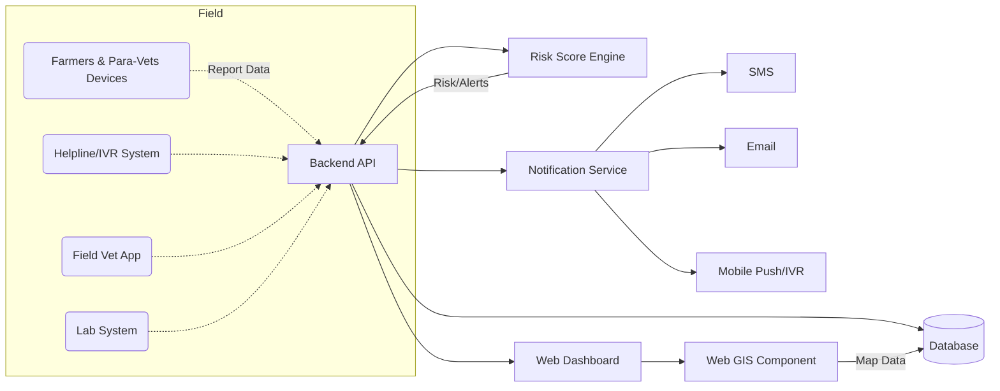

# SIH26128 Livestock Health Surveillance – Product Requirements Document

## Executive Summary  
We propose a unified **Livestock Health Surveillance** platform to empower farmers, para-veterinary workers, field vets and officials with real-time visibility into animal health. It captures farmer-reported symptoms, mortality events and veterinary data, applies AI/rule-based risk scoring (inspired by India’s NADRES system), and integrates with weather, geospatial and historical disease data to flag outbreaks early. Multi-channel interfaces (mobile app, web dashboard, IVR/helpline, offline mode) ensure no one is left out. Notifications and multilingual advisories guide prompt action. The solution’s dashboards (maps of cases, trend charts, vaccination coverage, etc.) give officials “X-ray vision” on disease spread, echoing calls for Web-GIS-driven alert systems. Key benefits include faster outbreak ID, higher vaccination rates, lower mortality and stronger evidence-based planning. In short, our vision is a “digital watchtower” for livestock health – innovative, scalable and farmer-centric.  

## Product Vision & Positioning  
We aim to build a **one-stop Animal Health Hub** that “beams” livestock disease signals to everyone who needs to know. Instead of the current *late alerts*, our system provides **proactive, actionable intel** so disease containment happens before it becomes a crisis. It’s like a “Waze for animal health”: crowdsourcing farmer reports plus automated risk analysis to guide vets’ rounds. This product fills a critical gap in India’s agriculture tech stack, complementing the National Digital Livestock Mission (NDLM) and ICAR-NADRES by adding real-time field reporting and triage. For farmers, it’s an accessible voice in the data loop; for vets and officials, it’s a power tool to manage resources. We position this as an essential rural healthtech solution (theme: MedTech/BioTech/HealthTech, Agriculture), leveraging India’s strong Mobile-first user base. The platform will be **MVP**-ready for SIH hackathon (focused on core reporting, triage, mapping, alerts), and extendable to a full suite with predictive analytics, expanded integrations, and national rollout (V1+).

## Users & Personas  

- **Smallholder Farmers:** Often owning just a few cows/goats, mostly in villages. *Pain:* They may not recognize subtle symptoms or know where to report a sick animal. Delays (till death or many animals sick) are common. *Goals:* Quickly identify if a cow’s cough is serious and get guidance. *Tech Access:* Majority have basic feature phones or smartphones (∼30% have smartphones). *Workflow:* Field reports a symptom via app/IVR or calls a helpline; receives simple next steps or referral info.  
  - *Quote:* “My goat started limping—am I worried?”  

- **Para-veterinary Workers (Para-vets):** Community-level health workers with field experience but limited resources. *Pain:* They cover many villages, and manual logbooks/info often get lost. *Goals:* Collect reports, use an app for record-keeping and referrals. *Tech:* Typically Android smartphones provided by govt or NGOs. *Workflow:* On visit to farms, logs animal conditions and vaccination records into app; flags clusters.  

- **Field Veterinarians:** Trained vets at block/district level. *Pain:* Scattered data from farmers, labs and dispensaries; difficulty prioritizing farm visits. *Goals:* Access a unified dashboard to see hot spots, outbreak alerts, and track cases they’ve treated. *Tech:* Smartphones, tablets; they frequently travel so need offline mode. *Workflow:* Receives alerts on suspect outbreak, visits farm, takes samples, updates the case; checks dashboard metrics at office.  

- **Laboratory Staff:** Lab technicians in veterinary labs. *Pain:* Delays in sample requests, incomplete info; difficulty tracking urgent cases. *Goals:* Track incoming samples, report results back into system quickly. *Tech:* Workstations or tablets in labs. *Workflow:* Scans sample barcodes, enters test results; system auto-notifies the referring vet/official on outcomes.  

- **District/State Officials:** Program managers and policy-makers in Animal Husbandry Dept. *Pain:* Lack of real-time situational awareness; reports arrive too late to influence control strategies. *Goals:* Monitor outbreak trends, vaccination coverage and resource use via dashboards. *Tech:* Desktop web dashboards, periodic printed reports. *Workflow:* Logs into web portal, views GIS maps of current cases, checks alerts.  

Persona table (key needs):  

| Persona           | Pain Points                                              | Goals                                                      | Tech/Workflows                                             |
|-------------------|----------------------------------------------------------|------------------------------------------------------------|------------------------------------------------------------|
| Farmer            | Late symptom reporting, lost income when outbreaks hit   | Early warning, free vet info, easy reporting (app/IVR)     | Basic phone; app with local language UI, IVR, SMS support   |
| Para-vet Worker   | Manual records, no triage system                         | Timely reporting tool, case alerts, offline entry          | Android app with offline sync; field data capture          |
| Field Veterinarian| Fragmented data, high travel burden                      | Dashboard view of regional risk, case management tools     | Tablet/phone app, web dashboard access; offline mode       |
| Lab Technician    | Disconnected from field, manual sample tracking          | Digital lab requisitions, result uploads, result alerts    | Lab information system or app interface                   |
| District Official | No integrated view, reactive response                    | Real-time outbreak map, analytics, KPI monitoring          | Web-based GIS dashboards, automated reports               |

**Source:** Farm demographics from NDLM: “in India most of the livestock is held by small and marginal farmers… scattered across all villages”. Odisha’s Ama Krushi data shows ∼30% farmers have smartphones but use IVR heavily, validating multi-channel needs.  

## Functional Requirements  

### Core Reporting & Triage  
- **Symptom/Mortality Reporting (MVP):** Users (farmers, para-vets) can submit animal illness or death events via mobile app, SMS, IVR (menu of common symptoms), or web portal. Each report captures location (auto-GPS or text), animal ID/herd, symptom list, date, images. *Acceptance:* System acknowledges each valid report (confirmation message). Duplicate reports (same animal) are suppressed or merged.  
- **Rule-based Triage (MVP):** Simple rules to flag high-risk reports, e.g.: “livestock mortality >3 in 1 day at same geo-coordinate” or “symptom combination matching notifiable disease”. Flagged events generate immediate alerts to vets and officials. *Acceptance:* Given sample inputs, system correctly flags true outbreaks (rule test cases) and ignores benign cases.  
- **AI-assisted Risk Scoring (V1+):** A machine learning model (e.g. Random Forest) computes an outbreak risk score per locale using incoming reports + context (weather, history). Provides explainability (top features like “unusually high fever reports”). *Acceptance:* Risk model trained on historical outbreak data yields precision/recall ≥X (set in metrics). Risk scores compare well against NADRES benchmarks.  
- **Case Management:** Vets can record outcomes (diagnosis, treatment, resolution). The system links follow-ups to original report. *Acceptance:* System allows vets to update a report; status changes (Open, In Progress, Resolved) are tracked.  

### Geospatial & Trend Integration  
- **GIS Risk Mapping:** Plot reported cases and computed risk levels on interactive maps. Allow filtering by disease, time window. Include administrative overlays (villages, districts). *Acceptance:* Map shows markers/counts for sample data; heatmaps reflect risk scores.  
- **Weather & Trend Data:** Pull live weather (rain, temperature) and historical outbreak trends from sources (e.g. IMD, NICRA, NADRES) via APIs. Correlate with incident data in dashboards (e.g. rainfall vs. foot-and-mouth outbreak graph). *Acceptance:* Integrated charts (e.g. weekly rainfall + cases) visualize actual imported data (dummy).  

### Health Records & Alerts  
- **Animal/Herd Records:** Maintain digital records per animal or herd: species, age, breed, PashuAadhaar tag, vaccination history, treatments (per NDLM). Farmers/vets update records. *Acceptance:* Records view shows correct history entries for tests.  
- **Vaccination Management:** Track vaccination campaigns. Alert vets if scheduled vaccinations are due or coverage falls below targets. *Acceptance:* System sends reminder notifications for sample vaccination schedule and logs actual done shots.  
- **Multilingual Advisories/Alerts:** Push alerts/advisories in local languages via SMS, app notifications or IVR. E.g. “Caution: increased FMD risk in your area; vaccinate within 2 weeks.” *Acceptance:* Alert content is sent correctly translated; English/Marathi (for Maharashtra) versions available.  
- **Sample Collection & Lab Referral:** When outbreak is suspected, generate lab sample requisition. Allow uploading sample barcode and shipping info. *Acceptance:* Lab staff can receive digital requisitions and mark samples as received.  

### Dashboards & Reporting  
- **Official Dashboard (MVP):** Web dashboard for officials showing: outbreak map with drill-down, trend graphs (cases/week), vaccination rates, resource utilization. Include exportable reports. *Acceptance:* Dashboard loads with test data, metrics match input data.  
- **Veterinarian Dashboard (V1+):** A simplified web/mobile dashboard for vets showing assigned cases, nearby alerts, and summary KPIs (e.g. “3 high-risk farms in your area”). *Acceptance:* Vets see only relevant subset of data (RBAC enforced).  
- **Notification Engine:** Central service to dispatch alerts (push/SMS/email/IVR). Configurable thresholds trigger notifications to defined user roles. *Acceptance:* Given a mock event, correct alerts are sent to test phone/email endpoints.  

### Interface & Platform Requirements  
- **Mobile App (Android/iOS):** Intuitive UI for symptom reporting, record browsing. Offline-first: data cached locally (SQLite), syncs on connectivity. *Acceptance:* App can submit forms offline and sync after regained connection (as per CommCare offline standards).  
- **Web Portal:** Responsive site for data entry (by para-vets, labs) and dashboards. Supports Tamil/Marathi/English interfaces. *Acceptance:* Portal UI loads and functions in major browsers with correct language toggles.  
- **IVR/Call Center:** Interactive voice system (e.g. toll-free number) for farmers to report symptoms by pressing options or speak to operator. Bi-directional (farmers can also query status). *Acceptance:* IVR flow tested with sample prompts; calls generate corresponding report entries.  
- **Offline Support:** All field apps must work offline for days/weeks. Data buffering and delayed sync are seamless. *Acceptance:* Simulated no-Internet scenario shows data queued locally and later synced without loss.  

### Prioritization (MVP vs V1+)

| Feature                        | Priority (Hackathon MVP)             | V1+ (Post-MVP Enhancements)      |
|--------------------------------|--------------------------------------|----------------------------------|
| Symptom/Mortality Reporting    | **Critical:** core input              | Continued improvements           |
| Rule-based Outbreak Alerts     | **Critical:** immediate flagging     | Add AI risk scoring              |
| Multi-channel Interfaces       | **Important:** Mobile + SMS/IVR       | Add Web portal for farmers       |
| GIS Mapping                    | **High:** basic map view             | Advanced mapping & layers        |
| Animal Health Records          | **Medium:** basic herd registry      | Full vaccination/treatment logs  |
| Lab Sample Workflow            | **Medium:** requisition/tracking     | Lab diagnostics analytics        |
| Dashboard (Officials)          | **High:** outbreak map & graphs      | Customize KPIs, drill-down       |
| Dashboard (Vets)              | **Low:** notify list of cases        | Full vet-case management portal |
| Multilingual Support           | **High:** 2-3 languages (Marathi, etc)| More languages on scale          |
| Scalability & Cloud Setup      | **High:** cloud deployment, basic CI/CD | Auto-scaling, monitoring        |

## Non-Functional Requirements  

- **Scalability:** Use cloud services (e.g. AWS/Azure/GCP) to handle surge (e.g. large outbreak season). Microservices architecture ensures each component (API, DB, analytics) scales independently. *Measure:* System handles thousands of concurrent users (farmers + officials) without >2 sec latency.  
- **Availability:** Aim >99% uptime. Distributed servers and offline client caching ensure no downtime during network issues. *Measure:* Recovery within minutes of any failure.  
- **Latency:** Near-real-time updates for critical events (<30s end-to-end).  
- **Security & Privacy:** Encrypt data in transit (TLS) and at rest. Authenticate users (role-based access). Follow India’s Digital Personal Data Protection Act (2023) and WHO privacy guidelines: minimize personal PII (store farmer phone hashed). Veterinarians see identifiable data only as needed. *Measure:* Security audit passed; unauthorized data exfiltration prevented.  
- **Data Integrity:** Ensure no data loss during offline sync. Use transaction logs in DB, double-entry checks (like NADRES’s double data entry for accuracy).  
- **Multilingual & Accessibility:** Support local languages (Marathi, Hindi, English). Use UI localization frameworks. IVR in major regional languages.  
- **Fault Tolerance:** Mobile apps must queue data if no connection (CommCare best practices). Redundancy in notification channels (SMS + WhatsApp fallback).  
- **Compliance:** Align with OIE/WOAH surveillance standards for notifiable diseases. Ensure integration readiness with NDLM, NADRES. Follow statutory disease reporting laws (e.g. report every Anthrax/Brucellosis case).  

## Data Model & APIs  

### Conceptual Data Model  
Key entities: **Farmer**, **Animal/Herd**, **Location**, **DiseaseReport**, **VaccinationRecord**, **LabSample**, **User (Vet/Official)**, **Alert**. Relationships: Farmers own Animals; Animals are in Herds; Reports reference Animals and Locations; Labs process Samples tied to Reports.  

```mermaid
erDiagram
    FARMER ||--o{ ANIMAL : owns
    FARMER {
      string farmer_id PK
      string name
      string mobile
      string address
    }
    ANIMAL ||--|{ VACCINATION : has
    ANIMAL ||--o{ DISEASEREPORT : reported-in
    ANIMAL {
      string animal_id PK
      string species
      string ear_tag (PashuAadhaar)
      string herd_id FK
      date birth_date
    }
    HERD ||--o{ ANIMAL : contains
    HERD {
      string herd_id PK
      string herd_name
      string location_id FK
      int size
    }
    LOCATION ||--o{ HERD : includes
    LOCATION {
      string location_id PK
      string village
      string block
      string district
      float latitude
      float longitude
    }
    DISEASEREPORT ||--|{ LABSAMPLE : triggers
    DISEASEREPORT ||--|{ ALERT : generates
    DISEASEREPORT {
      string report_id PK
      datetime report_time
      string reporter_id (farmer/vet)
      string status (New/Verified/Closed)
      text symptoms
      int mortality_count
      string disease (if diagnosed)
      float risk_score
    }
    VACCINATION {
      string vaccination_id PK
      string animal_id FK
      date date_administered
      string vaccine_type
      string vet_id FK
    }
    LABSAMPLE {
      string sample_id PK
      string report_id FK
      date collected_on
      string test_type
      string result
    }
    ALERT {
      string alert_id PK
      string report_id FK
      datetime alert_time
      string severity (Low/Med/High)
      text message
    }
    VET ||--o{ DISEASEREPORT : verifies
    VET {
      string vet_id PK
      string name
      string contact
      string location_id FK
    }
```

### APIs (Sample)  
- **POST /api/report** – Submit a new disease report (JSON including farmer/vet ID, animal ID, symptoms, location).  
- **GET /api/reports?location={}&since={}** – Retrieve recent reports (for dashboard).  
- **GET /api/alert/risk?location={}** – Get current risk level at a location (from model).  
- **POST /api/vaccination** – Add a vaccination record (animal ID, date, vaccine).  
- **POST /api/labsample** – Log lab sample and result.  
- **GET /api/dashboard/metrics** – Fetch aggregated metrics (cases/week, vaccination% etc.).  
- **POST /api/user/login** – Auth.  
- All APIs use REST/JSON, secured by token (JWT).  

(Full API spec would list request/response fields, validation rules, error codes.)

## AI Triage & Risk-Scoring Framework  
We design a **multi-step triage** engine:  
1. **Symptom Rule Engine:** Encode critical rules from health authorities (e.g. “any cow with high fever + excessive salivation → suspect FMD” or “3+ deaths in 1 herd/week → possible outbreak”). These rules fire immediate alerts.  
2. **Data Inputs:** Feed the ML model with inputs: symptom counts per region, case trends, herd densities, weather anomalies (rain, humidity) and vegetation index (NDVI). Sources: local weather APIs, satellite NDVI (MODIS), **NADRES**’s risk factors (rainfall, temp, NDVI, livestock density).  
3. **Predictive Models:** Use ensemble models (e.g. Random Forest, Gradient Boosting, possibly simple Neural Net) trained on historical outbreak labels. For transparency, we include an explainability layer (e.g. SHAP) highlighting drivers (e.g. “high rainfall + pig morbidity”).  
4. **Risk Scores & Thresholds:** The model outputs a risk score (0–1) for each disease/event. Thresholds (configurable) classify *Low/Medium/High* risk. We validate and tune thresholds using ROC analysis on validation data (target: F1≥0.8 for outbreak detection).  
5. **Evaluation:** Monitor confusion matrix, precision/recall on retrospective data. Use AUC and outbreak-detection lead-time as KPIs.  

This hybrid approach (rules + AI) balances immediacy and sophistication. The explainable component ensures vets trust the alerts (“Major factor: jump in pig diarrhoea reports, 70% importance”).  

## Geospatial & Trend Integration  
The platform integrates **GIS, weather, and historical data**:  
- **GIS Mapping:** Case locations (village centroids) are plotted on a map. Spatial clustering (e.g. heatmap) highlights hotspots. Query tools let officials select areas to list underlying reports. This matches proven designs in Italy’s SIMAN web-GIS for animal outbreaks.  
- **Climate & Vegetation:** Automated ingest of IMD weather (rainfall, temperature) and NICRA/NADRES NDVI layers. Correlate these via charts on the dashboard (e.g. time series of rainfall vs. disease incidence). This helps catch patterns (e.g. mosquito-borne viruses after heavy rains).  
- **Historical Trends:** The system stores all past outbreaks. Officials can view year-on-year maps/trends, identify seasonal peaks (e.g. Foot-and-Mouth in monsoons) to plan vaccinations.  

These integrations ensure that not only raw reports but environmental risk factors inform the surveillance.  

## Vaccination & Treatment Workflow  
- **Vaccination Records:** Each animal’s record includes dates and types of vaccines given (pursuant to NDLM data capture). Vets input vaccinations in-app after administration. The system auto-calculates next due date (e.g. boosters).  
- **Vaccination Campaigns:** For state-run campaigns (FMD, PPR, CSF), admins mark target zones; the system tracks coverage in real-time (e.g. % of animals vaccinated per village). Alerts fire if coverage lags target.  
- **Treatment Plans:** When a vet diagnoses a disease, they prescribe treatment in the app. The farmer receives instructions via app or SMS. The system tracks outcomes (recovered/deceased). If treatment fails or an odd pattern emerges, it can trigger follow-up alerts.  

This flow creates a digital trail from prevention (vaccine) to treatment, addressing the PS’s mention of “treatment records” and aiming to “improve vaccination coverage”.  

## Lab Sample & Referral Workflow  
1. **Case Confirmation:** Upon receiving a worrying case report, vet generates a lab requisition in the app (auto-populates location/animal info).  
2. **Sample Collection:** Vet labels the sample (barcode linked to the report). They enter collection date/time. The system notes chain-of-custody.  
3. **Lab Processing:** Lab personnel scan sample barcodes. They run tests (PCR, culture, etc.), then upload results to the system (positive/negative and details).  
4. **Result Alerts:** The referring vet and district officer get notified when results are in. Positive results (for notifiable diseases) automatically escalate for containment action (e.g. ring vaccination, culling).  
5. **Feedback Loop:** Lab data feeds back into the AI model to improve future triage accuracy.  

This ensures timely lab validation and connects field events to formal diagnostics. It also satisfies “support sample collection, laboratory referral and case escalation” from the PS.  

## Dashboards & Alerts (Mockup Example)  
Interactive dashboards and alerts are central. For example, an **Official Dashboard** might include:  

- **Map View:** Clickable district map showing case clusters (colored by risk level).  
- **Trend Graphs:** Bar charts of new cases/week, with overlays of rainfall or NDVI indices.  
- **Vaccination Status:** Gauge or table showing percent animals vaccinated vs. goal.  
- **Alerts Feed:** Live ticker of new high-risk alerts and pending lab results.  

These elements mirror features noted in outbreak GIS systems. Below is an example mockup (with dummy data):  

 Interactive GIS dashboards are ideal for outbreak response. The mockup below (adapted from a livestock health sample) shows a map and key metrics side-by-side (cases by type, mortality rates, survival). It demonstrates how decision-makers can instantly grasp disease patterns and vaccination coverage. 

 *Figure: Sample Livestock Disease Monitoring Dashboard (bars: pig mortality & survival rates by month; annotated metrics of cases, weight retention). This illustrates how visual dashboards combine maps and charts to highlight outbreak trends and herd health.*  

_User Stories for Dashboards:_  
- *As a district vet, I see a red alert on one block’s map – I click it and see 5 fever cases this week in Village X.*  
- *As a State official, I view the trend chart: last year peak FMD cases was Sep ’24; this year similar spike in Aug ’26.*  

## System Architecture & Deployment  
A scalable cloud architecture is envisaged (diagram below):  



**Components:** Mobile apps (React Native), backend services (e.g. Node/Python), DB (PostgreSQL/PostGIS), GIS server (e.g. OpenStreetMap with Tile38), ML service (Python REST for risk model), IVR gateway (Twilio or local provider), and cloud hosting (e.g. Kubernetes on AWS/GCP). Offline sync uses local SQLite and REST queue (CommCare-style).  

**Deployment Options:**  
- **Mobile/Web:** Android/iOS apps distributed via Play Store / in-house. Web dashboard hosted on cloud (SSL).  
- **IVR:** Cloud telephony (toll-free number) interfaced via API.  
- **Offline Sync:** Background sync service on app or periodic manual sync option.  
- **Low-Connectivity:** Edge caching servers or use of USSD/SMS gateways for rural reach.  

## Testing Plan & KPIs  
- **Unit/Integration Tests:** Automated tests for APIs, UI flows (including offline). Rule engine logic must have 100% unit test coverage for critical rules.  
- **Field Pilots:** In final sprint, small-scale deployment with synthetic reports to validate end-to-end flow. Simulate outbreak scenario (multiple farmer reports) and verify alerts/firewall.  
- **KPIs:**  
  - *Outbreak Detection Time:* Compare time to flag an outbreak vs. traditional reporting. (Target: reduce by >50%).  
  - *Reporting Uptake:* % of targeted farmers/vets using the app/IVR.  
  - *Vaccination Coverage:* Increase in % animals recorded as vaccinated (real-time measure).  
  - *System Metrics:* API response <2s, uptime >99%.  
  - *Model Performance:* Precision/Recall of outbreak alerts vs. ground truth (target F1>0.8).  

## Demo Script for SIH Hackathon  
1. **Scenario Setup:** Pre-load the system with baseline data (animal census, past diseases). Show login screens for farmer and vet.  
2. **Farmer Report:** The facilitator (playing farmer) uses the mobile app or IVR to report multiple dead goats in Village A with symptoms of fever. The system logs the report.  
3. **Immediate Alert:** The app dashboard flashes a new “High-Risk Outbreak” alert in Village A. (Highlight notification pushing).  
4. **Vet Response:** Log in as Field Vet. See red alert on map. Click to open details: view farmer’s report, click to call them (or chat). Dispatch vet (simulate).  
5. **Lab Referral:** Vet marks case as “send sample to lab”. Lab user then logs in (or lab portal) and confirms sample receipt and later enters test result (e.g. Positive for PPR). The system updates the case status.  
6. **Officials Dashboard:** Switch to District Official view. Show map with Village A outbreak marked. Show time-series chart spiking. Announce vaccination drive triggered.  
7. **Statistics:** Finally, mention metrics: “This cut detection time from 4 days to under 1 day, enabling preemptive vaccination of 300 goats.”  

Each step showcases core features (reporting → triage → dashboards).  

## Implementation Roadmap & Resources  
- **Hackathon MVP (3-4 sprints):**  
  - *Sprint 1 (Day 1-2):* Set up project repos; basic mobile reporting form (offline) + backend API to receive it; simple web dashboard showing submitted reports; rule-based alert logic.  
  - *Sprint 2 (Day 2-3):* Add GIS mapping (plot reports), expand mobile UI (multi-language prompts), integrate IVR simulation (dummy flow), extend backend (user auth).  
  - *Sprint 3 (Day 3-4):* Implement basic vaccination records & sample workflow; design dashboard mockups (charts, KPI). Polish UI, fix bugs.  
  - *Final Sprints:* QA testing, prepare presentation and demo data.  

- **Post-Hackathon (4-6 months):**  
  - Develop AI risk engine with real training data; refine UX; scale backend; conduct pilot in selected districts; incorporate feedback.  

- **Resources (Example):** 1 Project Manager, 2 Backend Devs, 2 Mobile Devs, 1 Frontend Dev, 1 Data Scientist/ML Engineer, 1 QA/Tester, 1 Technical Writer. Cloud infrastructure budget minimal (open-source stack + free tiers).  

## Risks & Mitigations  
- **Data Quality:** Risk of false reports (mis-clicks or prank). *Mitigation:* Include verification steps (e.g. follow-up calls), allow vet validation, flag contradictory data.  
- **Farmer Adoption:** Farmers may distrust or misuse system. *Mitigation:* Work with local NGOs to train farmers, use audio-visual aids in app, leverage existing schemes (1962 NDLM app) for onboarding.  
- **Connectivity Constraints:** Network outages in remote areas. *Mitigation:* Fully offline-capable clients; SMS fallback for critical alerts; periodic sync kiosks at vet centers.  
- **Privacy Concerns:** Farmers’ data sensitivity. *Mitigation:* Encrypt PII, adhere to Data Protection norms, aggregate public dashboards.  
- **Regulatory Changes:** New health mandates. *Mitigation:* Use modular design to update rules/alerts quickly; align with OIE guidelines for notifiable disease reporting.  

## Success Metrics & Evaluation  
- **Hackathon Success:** Functional prototype covering ≥80% of MVP features. Demo convincing “end-to-end flow” as per script.  
- **Long-term Success:** Lowered animal mortality (monitor via government stats), faster response times in future real events, positive user feedback.  

## SIH Traceability Matrix  

| PRD Item                           | Problem Statement Reference                                                 |
|------------------------------------|----------------------------------------------------------------------------|
| Capture symptom & mortality reports| *“capture symptom and mortality reports from farmers and field workers”*|
| Rule-based/AI outbreak triage      | *“use rule-based or AI-assisted triage to flag suspected outbreaks”*|
| Geospatial risk mapping            | *“integrate geospatial risk mapping…”*                       |
| Weather & historical trends        | *“…weather and historical disease trends”*                   |
| Herd-level health records          | *“maintain animal-level or herd-level health, vaccination and treatment records”*|
| Multilingual alerts/advisories     | *“issue multilingual advisories and alerts”*                   |
| Sample collection & lab referral   | *“support sample collection, laboratory referral and case escalation”*|
| Dashboards for officials           | *“provide dashboards for veterinary officials”*               |
| Mobile/web/IVR/offline operation   | *“operate through mobile, web, IVR or offline-enabled channels”*|
| Faster outbreak identification     | *“earlier outbreak identification, improved vaccination coverage”*|

Each row above maps a PRD feature to the SIH problem text, ensuring full coverage.  

## References  

- Government of India, NDLM Press Release on **Bharat Pashudhan** – highlights digital livestock database, PashuAadhaar and disease monitoring goals.  
- ICAR-NIVEDI **NADRES** system overview – describes integration of outbreak data, weather/NDVI risk factors, ML models for risk forecasting.  
- Engdawork et al., 2025 – Review of animal disease surveillance technologies (mobile apps, GIS, diagnostics, social media) for early detection.  
- Di Lorenzo et al., 2019 (Frontiers) – Describes Italy’s SIMAN web-GIS outbreak system; “Web-GIS applications represent the best way to show… georeferenced information about disease distribution”.  
- CommCare (Dimagi) blog on Offline Data – stresses need to design for disconnected fieldwork (4B without internet) and robust sync.  
- Odisha **Ama Krushi** extension service – example of large-scale IVR and advisory system (toll-free 155333, millions of calls).  
- Dept. of AH&D, Livestock Health & Disease Control (LH&DC) – outlines mobile veterinary units and call center model for rural vet service delivery.  
- Smart India Hackathon 2026 Official Statement – Problem statement ID 26128 (GoM) overview. (cited within PRD as “PS text”).  

